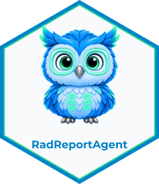
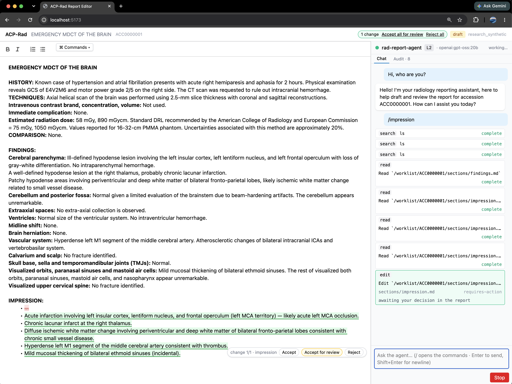

# ACP-Rad Demo 

A radiology report editor with an AI agent in the sidebar, connected through the
**[Agent Client Protocol (ACP)](https://agentclientprotocol.com)** and a small radiology
profile on top of it (**ACP-Rad**). The radiologist writes and decides; the agent only
proposes. Every proposed change shows up as tracked changes in the report and lands only
when the radiologist accepts it.



> ## ⚠️ Disclaimer
>
> This is a **technology demonstration**, built to show how a chatbot-style AI agent can be
> integrated into the sidebar of a radiology report editor through an open protocol (ACP).
>
> - It is **not intended for clinical use** and **is not a medical device** (not designed,
>   validated, or certified as software as a medical device under any regulation).
> - All reports, priors, templates, and patients in this repository are **synthetic**. No
>   real patient data (PHI) was used, and none must ever be entered.
> - AI-generated text is unverified. Nothing here replaces the judgment of a qualified
>   radiologist.
>
> Use it to learn, evaluate the integration pattern, or build your own — not to report
> real studies.

## What it demonstrates

**One editor, one protocol, any agent.** Without a protocol, every report editor that
wants an AI agent integrates each agent separately (M editors × N agents). With ACP each
side implements one contract (M + N). In this repo:

- the editor has **no agent-specific code** — it speaks ACP v1 over a WebSocket and
  learns what the agent can do from `initialize`;
- the agent has **no editor-specific code** — every byte it sees arrives through
  `fs/read_text_file`, every byte it proposes leaves through `fs/write_text_file`;
- swapping agents is safe because **the safety invariants live in the editor**, not the
  agent. The agent is untrusted by design.

**The human gate.** No text enters the report except through an explicit act of the
radiologist — typing, accepting a change, or running an editor command (INV-1). A proposal
is an overlay; accepting it is the write. Text accepted *for review* stays marked amber
until the radiologist touches it. Every read, proposal, decision, and write is stamped into
an audit trail.

**The ACP-Rad profile.** Radiology-specific behaviour rides only in ACP's sanctioned
extension points (`_meta.rad`, `_rad/*` methods) — never new root fields — so a plain ACP
agent still works, just with fewer features. The profile gives the agent a virtual namespace
(report sections, metadata, priors, templates, snippets), clinical verbs on permissions
(`accept · accept_edit · reject`), a write outcome (`applied | partial`), and a QA `flag`
channel. The draft proposal is in
[`docs/ideas/acp-rad-protocol-proposal.md`](docs/ideas/acp-rad-protocol-proposal.md).

## How it works

```text
 Radiologist
     │ types · prompts · accepts / rejects
     ▼
 apps/editor  (browser: React + QuillJS)          ── the ACP CLIENT
     │  owns the report, the human gate, the audit
     │  ACP v1 over WebSocket
     ▼
 apps/bridge  (Node)                              ── a dumb pipe
     │  WS frames ⇄ NDJSON on stdio; spawns one agent per connection
     ▼
 agents/rad-agent  (Python, deepagents-acp)       ── the ACP AGENT
     │  reads sections via fs/*, proposes edits, raises QA flags
     ▼
 LLM  (OpenAI · Anthropic · Ollama — switchable in the app)
```

The browser *is* the ACP client (the TypeScript SDK has no Node dependency). The bridge
exists only because ACP agents speak stdio; it never interprets the conversation.

## Quick start

Prerequisites: **Node ≥ 22** with [pnpm](https://pnpm.io), **Python ≥ 3.13** with
[uv](https://docs.astral.sh/uv/), [just](https://github.com/casey/just), and either an
LLM API key or a local [Ollama](https://ollama.com).

```sh
git clone https://github.com/radrama-ai/acp-rad-demo.git
cd acp-rad-demo
just install              # pnpm install + uv sync
cp .env.example .env      # put your OPENAI_API_KEY / ANTHROPIC_API_KEY here
just dev                  # bridge on :8787, editor on http://localhost:5173
```

Offline, no key, via Ollama:

```sh
# gpt-oss:20b
RAD_MODEL=openai:gpt-oss:20b RAD_MODEL_BASE_URL=http://localhost:11434/v1 just dev
```

Containerized, with only Docker Desktop plus a model provider:

```sh
cp .env.example .env      # add a provider key, or configure Ollama as noted in the file
just up                    # editor + nginx on http://127.0.0.1:8080
# another terminal, when finished:
just down                  # keeps the persistent audit volume
```

The container serves the editor and `/acp` from one browser origin; no bridge URL is baked
into the image. It is safe-by-default on loopback and can be bound to a Tailscale address for
a private demo. See [`docs/dev/running.md`](docs/dev/running.md#docker-compose).

Model and provider options, tracing, and troubleshooting: [`docs/dev/running.md`](docs/dev/running.md).

## Try it

Open http://localhost:5173. The default study is a synthetic emergency CT brain with the
impression blanked. Then:

| Do | What happens |
|---|---|
| Type `/impression` in the sidebar | The agent reads FINDINGS and proposes IMPRESSION items as tracked changes. **Accept**, **Accept for review** (amber, unreviewed), or **Reject** each one. |
| Keep typing while it works | Your edits never block and are never overwritten; a proposal whose anchor you changed conflicts and the agent re-reads. |
| Switch to `ct-chest-er-nodule-prior` and run `/compare` | The agent reads the prior reports and proposes a COMPARISON line and interval-change wording. |
| Run `/proofread` | Wording, house style, and FINDINGS ↔ IMPRESSION consistency (laterality, size, count). |
| Open `ct-wa-er-stone` and run `/qa` | A planted right/left discrepancy is raised as a flag card — no edit, just the finding. **Prelim** / **Sign off** run the same check as a gate. |
| `⌘ Commands ▾` | Deterministic editor commands that never touch the agent: `/template`, `/short-prelim`, `/er-reviewed`, `/discuss-with-dr`. |
| Change the model in the sidebar header | Plain ACP `session/set_config_option`; the agent rebuilds for that session. |
| **Audit** tab | The same records the bridge writes to `audit/{accession}.jsonl`. |

Other agents can be plugged into the bridge from `apps/bridge/agents.json`
(`?agent=claude`, `?agent=gemini`). They run at Level 0 — vanilla ACP, no profile — and
are wired but not yet exercised end-to-end (see *Status*).

## Repository layout

```text
apps/editor        Vite + React 19 + TypeScript + QuillJS 2 + Tailwind 4 — the ACP client.
                   Owns the human gate, read-only rules, the final lock, and the audit.
apps/bridge        Node + ws — WebSocket ⇄ stdio launcher for ACP agents (agents.json).
agents/rad-agent   Python 3.13 (uv) — deepagents-acp subclass; the ACP agent. stdout is the wire.
packages/acp-rad   TypeScript, framework-free — the profile as code (zod schemas, section ids, error codes).
Dockerfile         Multi-target build: nginx editor image + Node/Python bridge image.
compose.yaml       Local or Tailscale-only deployment; model env + persistent audit volume.
docker/            nginx reverse proxy + rad-agent-only container registry.
docs/              design · protocol · adr · progress · dev · ideas
CONTEXT.md         The glossary — every name in the code and UI comes from here.
```

## Development

```sh
just check     # dry gates: tsc, vitest, ruff, mypy, pytest
just smoke     # live gate: headless ACP client end-to-end through the bridge (needs an LLM)
just up        # build and run the containerized demo
just down      # stop it; retain the audit volume
```

Conventions: ACP **v1**; profile extensions only in `_meta.rad` and `_rad/*`; house
label-line report grammar; the agent is untrusted, so anything enforcing an invariant lives
in `apps/editor`; no PHI — fixtures carry `phiBoundary: research_synthetic`.

## Documentation

| Read | For |
|---|---|
| [`docs/design/01-system-architecture.md`](docs/design/01-system-architecture.md) | C1–C3, key flows, invariants, the profile as exercised |
| [`docs/design/02-surface-architecture.md`](docs/design/02-surface-architecture.md) | What the radiologist and the agent see: commands, the human gate, lifecycle |
| [`docs/design/03-agentic-architecture.md`](docs/design/03-agentic-architecture.md) | The agent: loop, tools over `fs/*`, the gate split across the boundary |
| [`docs/design/04-skills.md`](docs/design/04-skills.md) | `/impression` · `/compare` · `/proofread` · `/qa` as prompt expansions |
| [`docs/design/05-data-architecture.md`](docs/design/05-data-architecture.md) | The report as system of record, the namespace, proposals and grants, audit lineage |
| [`docs/protocol/01-acp-shape.md`](docs/protocol/01-acp-shape.md) | ACP as spoken here, every message shape, and the M×N → M+N analysis (§9) |
| [`docs/adr/`](docs/adr/) | Decisions: sidebar on assistant-ui, line-level hunks |
| [`docs/progress/overview-demo.md`](docs/progress/overview-demo.md) | Where the work stands |

## Status

A working demo, not a product. Built in vertical slices; slices 1–6 (tracer bullet →
proposals and the gate → commands, priors, snippets → QA flags → the QA gate and model
switching) are done. Known limits:

- The M+N claim is demonstrated by construction, not yet by measurement: a foreign ACP
  client driving `rad-agent`, and a Level 0 agent completing a scenario against the
  unchanged editor, are both deferred.
- Proposals are line-level hunks (ADR 0002); one-word edits strike and reinsert the line.
- No persistence beyond the fixtures and the audit log; no authentication, TLS termination,
  or rate limiting. Keep it on localhost or behind Tailscale — never expose it publicly.

## Acknowledgements

Built on the [Agent Client Protocol](https://agentclientprotocol.com) and its SDKs
(`@agentclientprotocol/sdk`, `agent-client-protocol`), [deepagents-acp](https://github.com/langchain-ai/deepagents),
[QuillJS](https://quilljs.com), and [assistant-ui](https://www.assistant-ui.com).

## License

[MIT](LICENSE) © 2026 Kittipos Sirivongrungson. The synthetic fixtures and report
templates are covered by the same license and carry no patient data.
