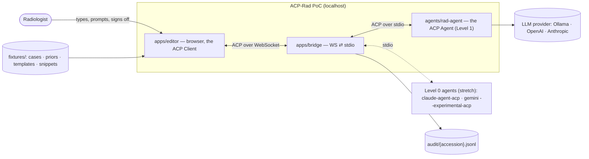
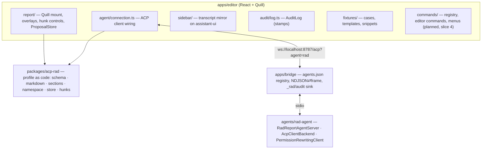
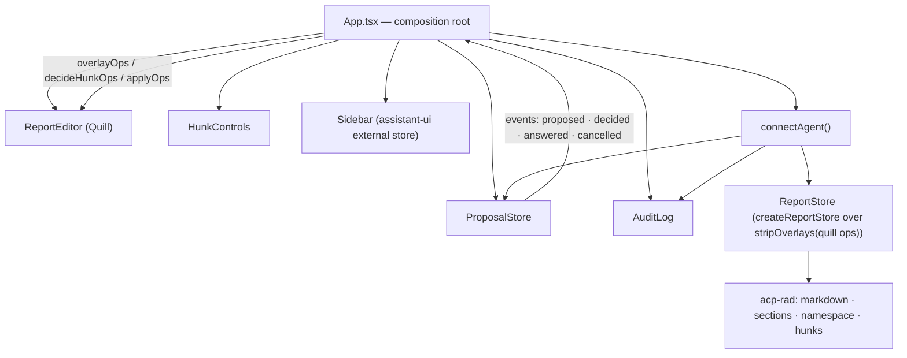
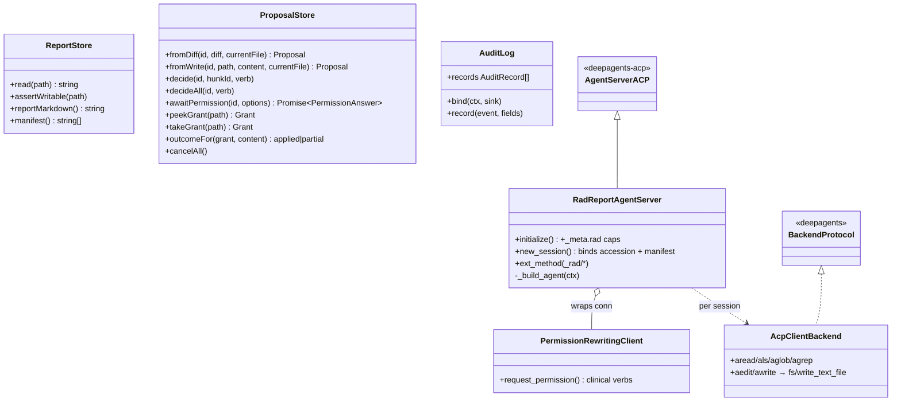
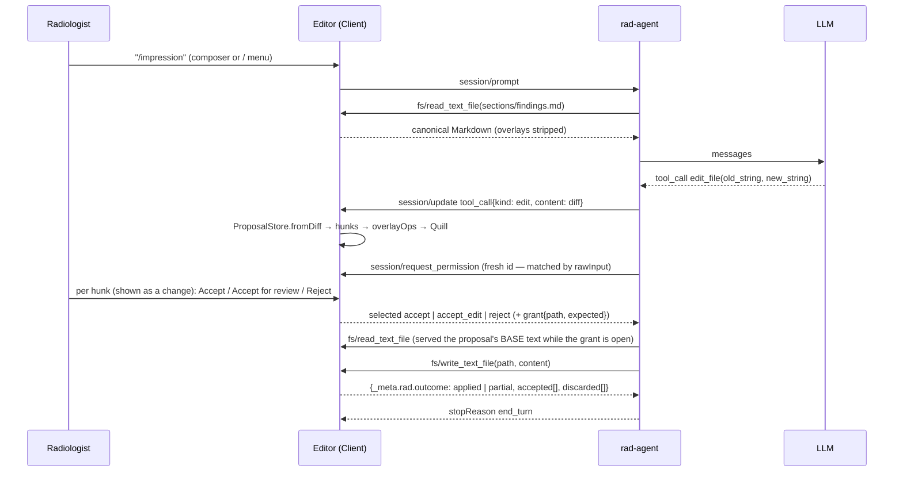
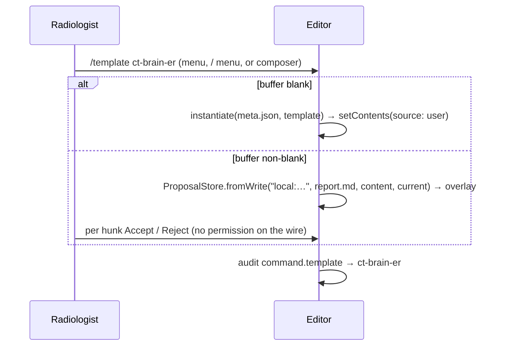

# ACP-Rad PoC — System & OOP Architecture

> Source: this repo (as built through slice 3, `cf0d6d3`) + slice-4 design session 2026-08-30 · Date: 2026-08-30 · Mode: Explain (built) + Design (slices 4–7, marked *planned*) · Type: Application
> See also: [Surface (UX/AX)](./02-surface-architecture.md) · [Agentic Architecture](./03-agentic-architecture.md) · Glossary [`CONTEXT.md`](../../CONTEXT.md) · Tracker [`progress/overview-poc.md`](../progress/overview-poc.md) · Profile proposal [`ideas/acp-rad-protocol-proposal.md`](../ideas/acp-rad-protocol-proposal.md) · Superseded draft [`archive/design/acp-rad-poc-spec.md`](../archive/design/acp-rad-poc-spec.md) (source survey §0, grilling ledger §11)

## 1. Overview

A radiology report editor in the browser (QuillJS) hosting an AI agent through the **Agent Client Protocol (ACP v1)**, extended by the **ACP-Rad profile** (`_meta.rad` + `_rad/*` only). The radiologist prompts; the agent proposes; every write passes the human gate inside the report. Demo target: radiology colleagues at Ramathibodi; the profile later consolidates into a separate standard, which this PoC *exercises* but does not define.

**Type: Application** — three entry points run: `apps/editor/src/main.tsx` (Vite SPA), `apps/bridge/src/index.ts` (Node WebSocket server), `agents/rad-agent/src/rad_agent/main.py` (stdio ACP agent). `packages/acp-rad` is a library, but only the editor consumes it.

**Stack.** pnpm workspace + uv project, `just` at the root. Editor: Vite · React 19 · TypeScript (strict) · QuillJS 2 · Tailwind 4 · `@agentclientprotocol/sdk` (browser-safe, WS stream) · `@assistant-ui/react` 0.15.17 pinned (ADR 0001). Bridge: Node 26 + `ws`, runs TS natively. Agent: Python 3.13 · `deepagents-acp` 0.0.11 subclass · LangChain providers (OpenAI-compatible incl. Ollama, Anthropic). Profile: zod.

### Invariants (the bar every change clears)

> **INV-1 (Human gate).** No byte enters the report buffer except through an explicit act of the radiologist — typing, accepting a hunk, or invoking an editor command. (*Sign-off* means finalization, not this.)
>
> **INV-2 (Non-interference).** The radiologist's typing never blocks and is never overwritten. A pending proposal is an *overlay* anchored by `(section, old lines)`, never by offsets; if the radiologist's edits make the anchor unfindable the hunk conflicts and the agent re-reads and re-proposes.

**Trust boundary.** Everything that enforces INV-1, read-only paths, the `final` lock, and the audit lives in `apps/editor`. The agent is untrusted; the bridge is a pipe. No PHI ever — fixtures are synthetic (`phiBoundary: research_synthetic`).

## 2. System Context (C1)

The browser **is** the ACP Client (the TS SDK has no Node dependency); there is no server-side client and no protocol duplication. The bridge exists only because ACP agents speak stdio.

## 3. High-Level Structure (C2)

| Path | Responsibility |
|---|---|
| `apps/editor/src/report/` | `ReportEditor.tsx` (uncontrolled Quill, `history.userOnly`, format whitelist) · `blots.ts` (`ai-insert`, `ai-delete`, `ai-draft`→*unreviewed* marks) · `overlay.ts` (pure `Op[]` transforms: render/decide/strip hunks, clear marks) · `overlayQuill.ts` (apply to a live Quill, post-user-change pass) · `HunkControls.tsx` (per-hunk pills) · `proposals.ts` (`ProposalStore`: proposals, grants, permission answers) · `reportStore.ts` (the `ReportStore` over live Quill with overlays stripped). |
| `apps/editor/src/agent/connection.ts` | `connectAgent()`: `initialize` + `session/new` with `_meta.rad`, serves `fs/read_text_file`/`fs/write_text_file` from the `ReportStore`, answers `session/request_permission` from hunk decisions, grant rule on writes, Level 0 hygiene (`set_mode: default`), cancel. |
| `apps/editor/src/sidebar/` | `store.ts` (reducer over ACP `session/update`s), `convert.ts` (ACP → assistant-ui `ThreadMessageLike`, the only file that knows assistant-ui types), `Sidebar.tsx` (thread, composer, tool cards that *mirror* decisions, audit tab). |
| `apps/editor/src/audit/log.ts` | `AuditLog`: stamps every consequential event, keeps the in-memory mirror, sends `_rad/audit` up the connection. |
| `apps/editor/src/fixtures/` + `apps/editor/fixtures/` | Synthetic cases (`meta.json` + `report.md` + `priors/*.md`), house templates, snippets; start-state rule (`demo.start`). |
| `apps/editor/src/commands/` *(planned)* | One command registry feeding `Commands ▾`, the in-report `/` menu and the composer `/`; deterministic editor commands (document · snippet). See [surface §2](./02-surface-architecture.md#2-surface-map). |
| `packages/acp-rad/src/` | `schema.ts` (zod for `_meta.rad`, statuses, clinical verbs, write outcome, audit record, error codes) · `markdown.ts` (Delta ⇄ canonical Markdown) · `sections.ts` (label-line partition) · `namespace.ts` (virtual paths, RO rules, manifest) · `store.ts` (`createReportStore`) · `hunks.ts` (line diff, `buildHunks`/`applyHunks`). Framework-free; the seed of the standard's reference implementation. |
| `apps/bridge/` | `src/index.ts`: `GET /acp?agent=<id>` spawns `agents.json[id]`, re-frames NDJSON ⇄ WS frames, intercepts only editor-originated `_rad/audit` → `audit/{acc}.jsonl`; `BRIDGE_TRACE=1`. `scripts/smoke.ts`: headless live tracer. |
| `agents/rad-agent/src/rad_agent/` | `server.py` (`RadReportAgentServer`) · `permissions.py` (`PermissionRewritingClient`) · `backend.py` (`AcpClientBackend`) · `agent.py` (`build_agent` → `create_deep_agent`) · `config.py` (`RAD_MODEL`) · `prompts/system.md` · `main.py`. stdout is the wire; logs to stderr. |

## 4. Components (C3) — inside `apps/editor`

Data ownership, in one line each: **Quill** owns the document (overlays are Delta attributes on it); **ProposalStore** owns proposals, hunk states, grants and the pending permission promise; **sidebar store** owns only a mirror of `session/update`s; **AuditLog** owns the trail; **ReportStore** owns nothing — it is a pure view (canonical Markdown of the live buffer with overlays stripped) plus the namespace rules.

## 5. OOP & Class Architecture

Patterns, named: **Seam** — `ReportStore` is the one door to report content (v2-readiness: on ACP v2 it becomes MCP-over-ACP tools and nothing above it changes). **Proxy** — `PermissionRewritingClient` swaps deepagents' `approve/reject/approve_always` for the profile's clinical verbs without copying `_handle_interrupts`. **Adapter** — `AcpClientBackend` makes the editor's `fs/*` look like a deepagents filesystem; `ls`/`glob`/`grep` are answered from the session manifest since ACP v1 has no directory listing. **Overlay-as-attributes** — proposals are Quill formats (`ai-insert`/`ai-delete`) on the live Delta, stripped by `stripOverlays` before any read, so pending text is rendered but never *in* the buffer. **Reducer mirror** — the sidebar never owns a decision; assistant-ui gets no `onRespondToToolApproval`.

## 6. Key Flows

### 6.1 Prompt → proposal → human gate (Level 1, as built)

Grant rule (`connection.ts`): `final` ⇒ `-32003`; RO path ⇒ `-32003`; grant found and `canonical(content) === expected` ⇒ `applied`; grant found but differs (partial acceptance, or the agent wrote more than it showed) ⇒ `partial` — the buffer keeps the radiologist's per-hunk result; the agent's content never lands directly. No grant ⇒ **unsolicited write** (Level 0 / unasked `write_file`): synthesize hunks from current vs content, render, hold the request until decided, `-32010` if all discarded. Grant read-through lasts ≤ 60 s.

### 6.2 Editor command (deterministic, *planned* slice 4)

Editor commands never touch the agent; they share the overlay machinery of §6.1 for the non-blank case (option C) and resolve locally.

### 6.3 Cancel

Editor sends `session/cancel`; `ProposalStore.cancelAll()` discards rendered hunks and answers every in-flight `request_permission` with `cancelled` (ACP contract); the agent returns `stopReason: cancelled`. *Planned:* visible "stopped" marker on the interrupted turn.

### 6.4 QA flag (Level 2 method, *planned* slice 5)

Agent tool `raise_flag(kind, summary, locations)` → `_rad/flag` request → editor flag card (the one decision the sidebar owns) → `{outcome: "acknowledged"}` → audit `flag.raised` / `flag.acknowledged`. No edit is made. Kinds: `discrepancy` · `omission` · `unsupported` · `critical_uncommunicated` (design 04 §3.5). The same path serves the QA gate at Prelim / Sign off (slice 6): the editor sends `/qa` and counts the flags; the agent never knows it is a gate.

## 7. Extension Points

| Seam | How |
|---|---|
| Another ACP agent | one entry in `apps/bridge/agents.json`; `?agent=<id>`. Level 0 needs the on-disk mirror + file-watch (slice 7). |
| Model / provider | `RAD_MODEL` (+ `RAD_MODEL_BASE_URL` for any OpenAI-compatible endpoint); keys via `lb key run`. |
| New case / template / snippet | drop files under `apps/editor/fixtures/`; the loader globs them; `meta.json` binds the session. |
| New editor command | one `Command` in the registry (*planned*); pure function over canonical Markdown, unit-tested. |
| New agent skill | `available_commands_update` from `RadReportAgentServer` + prompt expansion (*planned*); deepagents `skills=` later (routed through a `CompositeBackend` — the ACP backend cannot serve skill files). |
| New profile method | `_rad/*` via `ext_method`/`ext_notification` (agent) and generic `onRequest` (editor); schema in `packages/acp-rad`. |
| ACP v2 | re-expose `ReportStore` as MCP-over-ACP tools; editor and Quill code unchanged. |

## 8. The Profile as Exercised (deltas to the proposal)

| Proposal item | PoC decision |
|---|---|
| Virtual namespace (§4) | `/worklist/{acc}/{report.md, sections/{id}.md, meta.json}` RW*, `/priors/**`, `/templates/**`, `/snippets/**` RO. RW* = only via the proposal flow. `session/new._meta.rad.manifest` lists every readable path (v1 has no `ls`). Absent section ⇒ absent file ⇒ `-32004`. |
| Canonical Markdown (§4.2) | **Rama label-line grammar**, not H2 headings: `**LABEL:** text` lines, `**Organ:** text` inside FINDINGS, `- ` impression items, blank line only before top-level labels, no headings. Sections `history · technique · comparison · findings · impression`; the title line precedes the first label (RO). Literal `*`/`_` are not escaped (`___` blanks, `E_V_M_` stay literal). |
| Session binding (§5) | `_meta.rad` on `session/new`: `accession, modality, region, protocol, setting, reportStatus, phiBoundary, manifest`. **`reportStatus ∈ {draft, preliminary, final}` + `shortPrelim: boolean`** (2026-08-30; replaces the 4-state enum). |
| Levels (§3) | inferred from `initialize.result._meta.rad`; absent ⇒ Level 0. Client supports all three at once. |
| Clinical verbs (§7.2) | `accept · accept_edit · reject` on the wire; no `allow_always` on writes, ever. UI words: *Accept · Accept for review · Reject*, on a *change* (the UI word for a hunk). |
| `_rad/section_patch` (§8.3) | **Dropped** — per-section files make `edit_file` field-precise; v1 has no custom content types. Codes may ride in `_meta.rad.codes`. |
| `_rad/focus_state` (§8.1) | Focus carried in `session/prompt._meta.rad.focus` (turn-based agent); the stream stays OPTIONAL for proactive agents. |
| Write outcome | `WriteTextFileResponse._meta.rad = {outcome: applied \| partial, accepted, discarded}` — new in the PoC. |
| Errors (§10) | `-32003` forbidden (RO/final) · `-32004` not found · `-32010` proposal rejected · `-32011` canonicalization conflict. |
| Audit (§9.2) | Stamped by the Client, persisted by the bridge as JSONL; never trusted from the agent. |
| Proposal-doc fixes pending | grammar → label-lines; drop §8.3; status enum; "Flutter Quill" → QuillJS; `ramaai-dev` → `radrama-ai`. |

Profile wording to carry into the standard: *Clients MAY offer deterministic commands; Agents advertise theirs.*

## 9. Key Abstractions

See [`CONTEXT.md`](../../CONTEXT.md) — the glossary is canonical; this doc uses its terms (Human gate, Proposal, Hunk — *change* in the UI —, Grant, Unreviewed text, Editor command, Skill, Short prelim, Fold-in, Sign-off = finalization).

## 10. Decisions Needed & Notes

Settled decisions from the 2026-08-29 grilling live in the archived draft's §11; the slice-4 decisions of 2026-08-30 (deterministic `/template`, instant editor inserts, option C on non-blank, home-anchored snippets, `shortPrelim` flag, mark renamed *unreviewed*, INV-1 named *Human gate*, hunk shown as *change*, verbs *Accept / Accept for review / Reject*) are recorded in the surface doc and the glossary. Open, attached to scheduled work:

- 💡 **Skills transport** (slice 5+): deepagents loads `skills=` through the backend, and ours is the ACP client backend — route `/skills/**` to a local `FilesystemBackend` via `CompositeBackend`, or advertise skills purely by prompt expansion. Decide at slice-5 planning.
- Model-visible partial outcome: deepagents' `EditResult` cannot carry `_meta`; after a `partial` the model learns the truth only by re-reading (the prompt says so). v0.2 candidate: a `_rad/` notification.
- `session/load` resume and `session/set_config_option` model switching: out of v0.1.
- Word-level hunks: kept as the alternative in ADR 0002.
