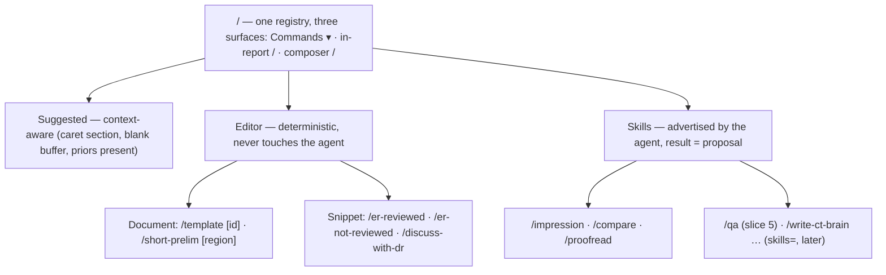
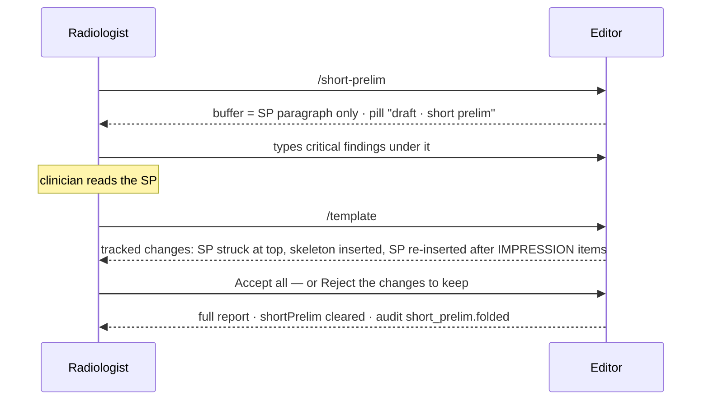
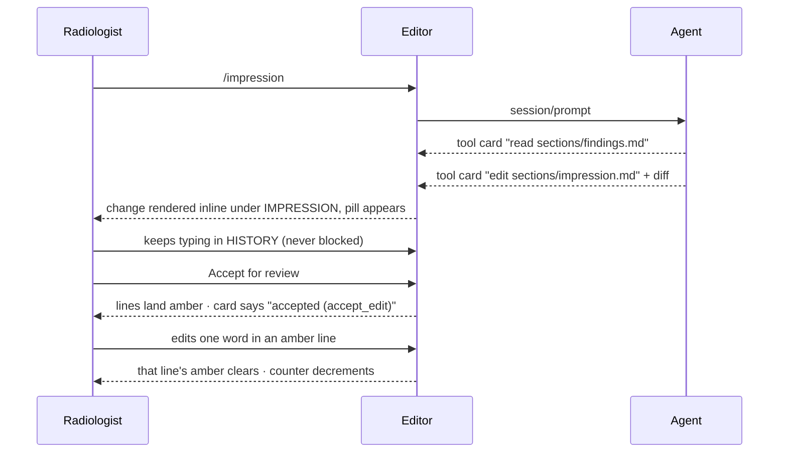
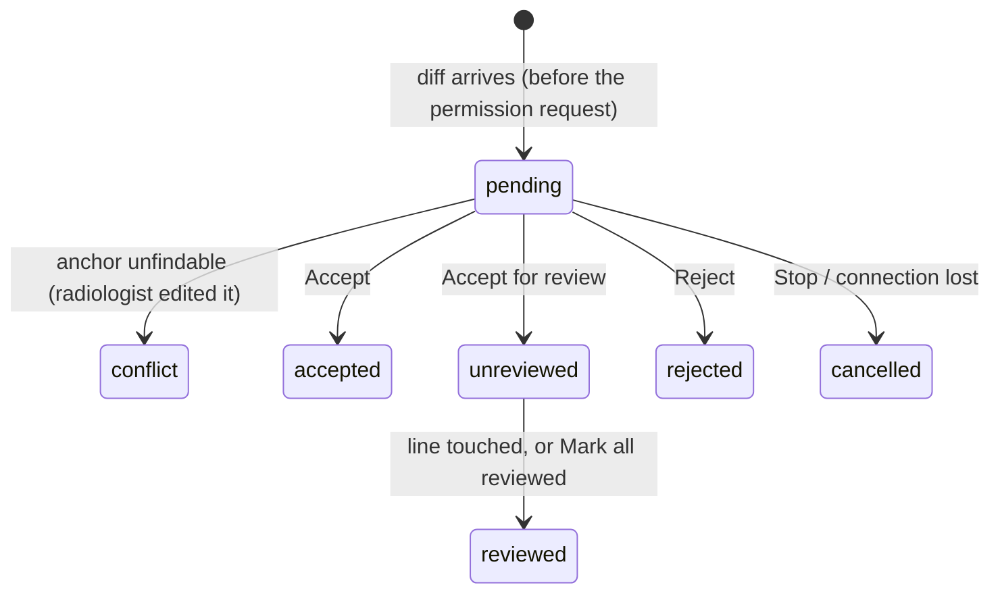
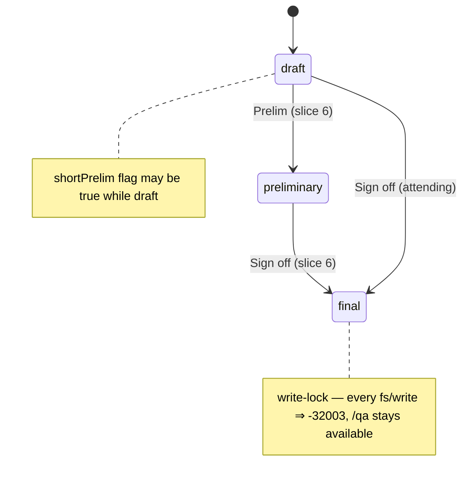

# ACP-Rad PoC — Surface Architecture (UX · AX)

> Source: this repo (as built through slice 3) + wireframes `_playground/2026-08-29_wireframe-b/` ([canvas](https://claude.ai/code/artifact/fbdd654e-1370-4ef0-b655-cad64d9e41b7)) + slice-4 design session 2026-08-30 · Date: 2026-08-30 · Mode: Explain (built) + Design (*planned* = slice 4+) · Surface: Hybrid — GUI app (radiologist) + file-shaped agent surface (AX)
> See also: [System & OOP Architecture](./01-system-architecture.md) · [Agentic Architecture](./03-agentic-architecture.md) · Glossary [`CONTEXT.md`](../../CONTEXT.md) · Runbook [`dev/running.md`](../dev/running.md)

## Cheat Sheet

| I want to… | Do |
|---|---|
| Start | `just dev` → http://localhost:5173 (bridge on `ws://localhost:8787/acp?agent=rad`) |
| Scaffold a blank ER study | `/template` (id defaults from the study's `meta.json`) — *planned* |
| Issue a short prelim | `/short-prelim` (region defaults from the study) — *planned* |
| Draft the impression | `/impression` (or type it in the composer) |
| Decide a change | **Accept** · **Accept for review** · **Reject**; bulk: *Accept all for review* · *Reject all* |
| Clear amber (unreviewed) text | edit the line, or **Mark all reviewed** |
| Compare with the prior | `/compare` — *planned* |
| Mark attending review | `/er-reviewed` · `/er-not-reviewed` — *planned* |
| Stop the agent | **Stop** in the sidebar |
| See what happened | sidebar **Audit** tab (same records as `audit/{accession}.jsonl`) |

Vocabulary note: the built slice-3 UI says *Insert / Insert as draft / Discard*, "hunks" and "AI draft lines"; the canonical UI words are *Accept / Accept for review / Reject* on a *change*, and *unreviewed* text (2026-08-30, see `CONTEXT.md`). The rename lands with slice 4.

## 1. Overview

One screen, two users. The **radiologist** writes and decides a report in a Quill editor with an agent sidebar; the **agent** sees the same report as a tiny read-mostly filesystem and can only *propose*. Surface type: GUI app (`apps/editor`) + an agent-facing file surface (`fs/read_text_file`/`fs/write_text_file` over the virtual namespace). The radiologist reaches it in a browser on localhost; the agent reaches it through ACP.

## 2. Surface Map

### 2.1 Screen

```
┌ header: ACP-Rad · study title · accession · [n changes ▸ Accept all for review · Reject all]     [n unreviewed ▸ Mark all reviewed] · status pill ┐
├ toolbar: B I ≡ 1.                                                    [⌘ Commands ▾] │ ● rad-agent  L1 · model        ready │
│                                                                                     │ [Chat] [Audit · n]                   │
│  **EMERGENCY MDCT OF THE BRAIN**                                                    │  you: /impression                    │
│  **HISTORY:** …                                                                     │  agent: ▸ read sections/findings.md  │
│  **FINDINGS:**                                                                      │  agent: ▸ edit sections/impression   │
│  **Cerebral parenchyma:** …                                                         │         awaiting your decision       │
│  **IMPRESSION:**                                                                    │         in the report                │
│  ~~- ...~~                              ◄ struck old line (ai-delete)               │                                      │
│  ++- Acute infarct, left MCA territory++ ◄ inserted line (ai-insert)                │                                      │
│     [Accept] [Accept for review] [Reject]    ◄ floating pill per change             │  [Ask the agent… (/ opens the menu)] │
│  /impr▏ ┌ Suggested · Editor · Skills ┐     ◄ in-report / menu at the caret          │  [Send] / [Stop]                     │
└─────────────────────────────────────────────────────────────────────────────────────┴──────────────────────────────────────┘
```

| Touchpoint | What the radiologist does with it |
|---|---|
| Report (Quill) | Types freely, always. Bold/italic/lists only. Undo covers own edits only. |
| Change pill | Decides one change (a hunk): Accept (lands plain) · Accept for review (lands amber) · Reject. |
| Header counters | Bulk decide pending changes; clear all unreviewed text. |
| Status pill | Shows `draft · short prelim` / `preliminary` / `final`; *planned* (slice 6): Prelim / Sign off actions; `final` locks writes. |
| `Commands ▾` (toolbar) | The full command list, grouped. *planned* |
| `/` in the report | Notion-style menu at the caret; filters as you type. *planned* |
| Sidebar · Chat | Transcript, thought chunks, tool cards mirroring decisions; composer with `/` menu; Send / Stop. |
| Sidebar · Audit | Live audit trail. |
| Alert card | `_rad/critical_finding` acknowledgement — the one decision the sidebar owns. *planned* (slice 5) |
| Worklist | 3 synthetic cases. *planned* (slice 6); until then a `?case=<id>` URL parameter (*planned*, slice 4). |

### 2.2 Commands



| Command | Class | Effect | Anchor / target |
|---|---|---|---|
| `/template [id]` | document | Instantiate a house template from the study's `meta.json`: `[Male]`/`[female]` lines resolved by sex, dose filled, `___` clinical blanks kept. Blank buffer → instant; non-blank → tracked changes (option C). If the buffer is a short prelim, the SP text (minus "A full report will follow.") is **folded in** between the impression items and the discussed-with line, and `shortPrelim` clears. | whole buffer; `id` defaults to `meta.study.template` |
| `/short-prelim [region]` | document | Buffer := the region's SP paragraph, nothing else; `shortPrelim := true`. Same blank/non-blank rule. | whole buffer; region defaults to `session.region` (`brain`, `chest`, `body`) |
| `/er-reviewed` · `/er-not-reviewed` | snippet | Attending-review marker line. A toggle set: one replaces the other. No status effect. | impression head (after `**IMPRESSION:**`, before items) |
| `/discuss-with-dr` | snippet | "The findings about ___ … discussed with Dr.____ …" line with blanks. | report end |
| `/impression` | skill | Agent reads FINDINGS, proposes the IMPRESSION items. | proposal on `sections/impression.md` |
| `/compare` | skill | Agent reads `/priors/…`, proposes COMPARISON text. | proposal on `sections/comparison.md` |
| `/proofread` | skill | Agent proposes wording fixes, section by section. | proposals |
| `/qa` *(slice 5)* | skill | Findings/impression discrepancy → alert card; no edit. | `_rad/critical_finding` |

Rules: editor commands insert **instantly** with source `user` (⌘Z undoes; audited as `command.<id>`) — the radiologist's invocation *is* INV-1's explicit act. Snippets are **home-anchored**: wherever the menu was summoned, the text lands at its home and scrolls into view. Skills from a Level 0 agent are not shown (they list the host user's personal skills).

### 2.3 The agent's surface (AX)

| Path | Access | Content |
|---|---|---|
| `/worklist/{acc}/report.md` | RW* | whole report, canonical Markdown |
| `/worklist/{acc}/sections/{history\|technique\|comparison\|findings\|impression}.md` | RW* | one section; absent section ⇒ `-32004` |
| `/worklist/{acc}/meta.json` | RO | de-identified study metadata (modality, region, protocol, sex, dose, template id) |
| `/priors/index.md` · `/priors/{acc}/report.md` | RO | prior reports |
| `/templates/{id}.md` · `/snippets/{id}.md` | RO | house templates, quick text |

RW* = writable only through the proposal flow. The Client sends every readable path in `session/new._meta.rad.manifest`; `ls`/`glob`/`grep` answer from it. Errors teach the next move: `-32003` read-only or final, `-32004` outside the namespace, `-32010` discarded by the radiologist, `-32011` buffer moved — re-read and re-propose. A write acknowledges with `{outcome: applied | partial, accepted[], discarded[]}`; after `partial` the agent must re-read before building on the edit. Slash commands the agent offers arrive via `available_commands_update` and are rendered in the *Skills* group.

## 3. Entry & Onboarding

```sh
just install && just dev          # bridge + editor; the bridge spawns the agent per connection
lb key run openai-personal -- just dev                                          # hosted model
RAD_MODEL=openai:gpt-oss:20b RAD_MODEL_BASE_URL=http://localhost:11434/v1 just dev   # offline, Ollama
```

Open http://localhost:5173: the default case (`ct-brain-er-stroke`, impression blanked by its `demo.start` rule) loads, the sidebar dot turns green when `session/new` succeeds (`rad-agent · L1 · <model>`), and the composer is enabled. First move for the demo: type `/impression` and press Enter.

## 4. Key User Journeys

### 4.1 Scenario 0 — blank ER study → `/template` *(planned)*

Open the blank CT brain study → `/` → *Suggested: /template ct-brain-er* → Enter → the filled skeleton appears instantly (dose from `meta.json`, blanks kept) → type HISTORY. Status stays `draft`. "Why would I use this" moment: seconds, no model.

### 4.2 Scenario 3b — short prelim → full report *(planned)*



### 4.3 Scenario 1 — `/impression` (built, slice 3)



### 4.4 Scenario 2 — `/compare` *(planned)*; 4 — Reject; 5 — Cancel

`/compare` on a case with a prior: tool card "read /priors/ACC…/report.md" → COMPARISON change → Accept. Reject: the change vanishes, the card says "rejected", the agent's turn ends gracefully. Cancel: **Stop** → every rendered change is dropped, pending permission answered `cancelled`, the turn shows a *stopped* marker (*planned*).

## 5. Interaction & State

### 5.1 A proposal's changes (hunks)



All hunks decided ⇒ the permission is answered once: any *Accept for review* ⇒ `accept_edit`; else any *Accept* ⇒ `accept`; all *Reject* ⇒ `reject`. The write that follows acks `applied` or `partial`; the buffer never changes at that point.

### 5.2 Report lifecycle



`shortPrelim` is set by `/short-prelim` and cleared when the SP is folded into a full skeleton. ER Reviewed / Not Reviewed markers are body text and never move the status. Roles (resident: draft/preliminary; attending: also final) are display-only in the PoC.

### 5.3 Connection & turn

Sidebar header dot: `disconnected` · `connecting` · `ready` · `error` (reason shown in the thread). Composer: Send while idle, Stop while running. Unknown `session/update` kinds are tolerated silently. Level 0 agents: `allow_always` never appears; the editor pins `session/set_mode: default`.

## 6. Information Architecture & Naming

- **Two namespaces, one grammar.** Every command is `/verb-noun` or `/noun`; editor commands are nouns for *what lands* (`/template`, `/er-reviewed`), skills are verbs for *what the agent does* (`/impression` is the exception kept for demo brevity). The `/` menu groups by who acts: **Suggested · Editor · Skills**.
- **Judgment happens in the report.** Verbs on change pills, counters in the header, mirrors in the sidebar — the sidebar never owns a decision except the QA alert.
- **Colour = provenance.** Green overlay = proposed, not in the buffer. Amber = in the buffer, unreviewed AI text. Plain = the radiologist's.
- **Report grammar is house style.** Label-lines, no headings; the editor never auto-bolds or reflows.
- **AX.** The agent gets a self-describing file tree (manifest), one canonical serialization, errors that name the next move, and an outcome on every write — the same surface for our agent and for any registry agent.

## 7. Configuration & Customization

| Knob | Where | Values |
|---|---|---|
| Agent | bridge URL `?agent=` (`VITE_BRIDGE_URL` today; URL param *planned*) | `rad` (default) · `claude` · `gemini` — from `apps/bridge/agents.json` |
| Model | `RAD_MODEL`, `RAD_MODEL_BASE_URL`, provider keys | see [`dev/running.md`](../dev/running.md) |
| Case | default = first fixture; `?case=<id>` *(planned)*; worklist *(slice 6)* | `apps/editor/fixtures/<case>/` |
| Demo start state | `meta.json.demo.start` | `complete` · `impression_empty` |
| Templates / snippets | `apps/editor/fixtures/{templates,snippets}/*.md` | canonical Markdown |
| Tracing / audit | `BRIDGE_TRACE=1`, `AUDIT_DIR` | — |

## 8. Decisions Needed

- 💡 **`/sign-off`**: an editor command in the same registry (fits "one list, three surfaces") or only an action on the status pill (fits "status transitions are explicit, not commands")? Decide at slice-6 planning; the registry design must not preclude either.
- 💡 **Case switching before slice 6**: `?case=<id>` is the cheapest way to reach the prior-bearing cases for `/compare`; confirm it is acceptable demo UX until the worklist lands, or pull the switcher forward.
