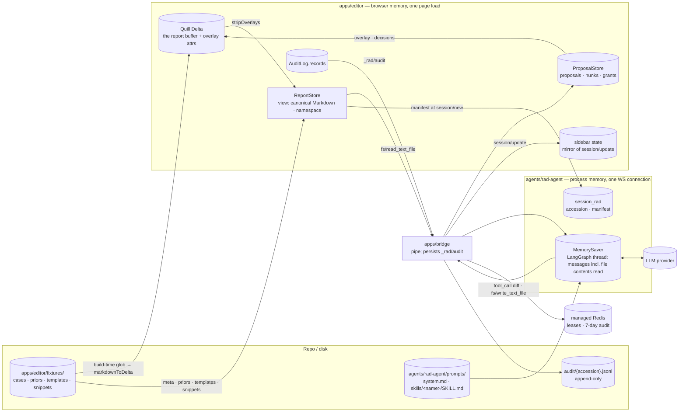
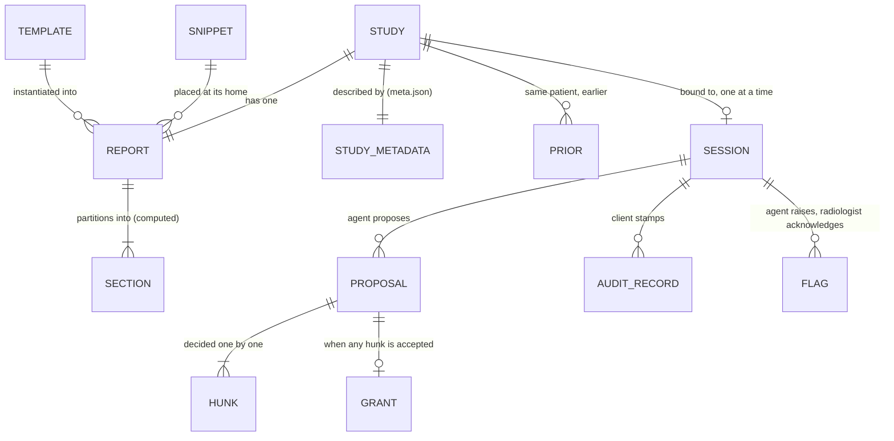
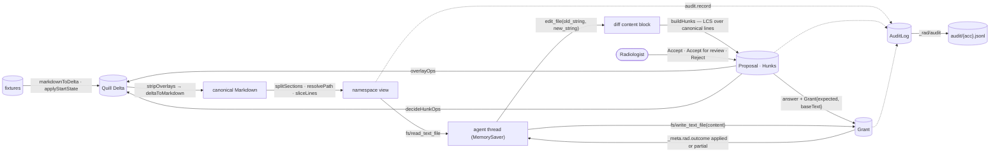
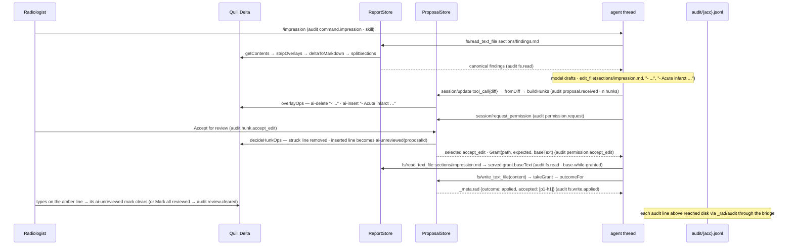

# ACP-Rad Demo — Data Architecture

> Source: this repo at `main @ 96ffec2` (built through slice 4; slices 5–6 folded in on 2026-08-30) · Date: 2026-08-30 · Mode: Explain · Data system: **Hybrid** — an in-memory document (the report) served as a schema-on-read virtual namespace · file fixtures · an event stream with an append-only audit log
> See also: [System & OOP Architecture](./01-system-architecture.md) · [Surface (UX/AX)](./02-surface-architecture.md) · [Agentic Architecture](./03-agentic-architecture.md) · [Skills](./04-skills.md) · **[ACP wire shape](../protocol/01-acp-shape.md)** — the protocol every flow below rides on · Glossary [`CONTEXT.md`](../../CONTEXT.md)

## 1. Overview

The system manages **one radiology report per study** (keyed by accession), the reference material around it (study metadata, priors, templates, snippets), the agent's **proposals** and the radiologist's **decisions** on them, and the **audit trail** of all of it. The report itself has no database: it lives in the browser as a Quill Delta and is served to the agent as canonical Markdown through a virtual file namespace. Public-demo operations use Redis only for anonymous connection admission and expiring audit records; Redis never stores the report. **Nothing the agent sends is ever stored as report content** — its writes are *compared* with what the radiologist decided, never applied (INV-1).

Classification evidence, one line per facet:

| Facet | Evidence |
|---|---|
| In-memory document | `quill.getContents().ops` is the report; `createReportStore` reads it live on every call (`apps/editor/src/report/reportStore.ts`, `packages/acp-rad/src/store.ts`). No save, no `localStorage`: a reload restores the fixture. |
| Schema-on-read namespace | `packages/acp-rad/src/namespace.ts` resolves `/worklist/…`, `/priors/…`, `/templates/…`, `/snippets/…` per read; sections are computed by `splitSections`, not stored. |
| File fixtures | `apps/editor/fixtures/**` loaded at build time by `import.meta.glob` (`apps/editor/src/fixtures/index.ts`); `apps/bridge/scripts/smoke.ts` reads the same tree from disk. |
| Event stream + append-only log | ACP JSON-RPC frames; `ProposalStore` events; the sidebar reducer; `AuditLog` → `_rad/audit` → Redis list on Vercel or `audit/{accession}.jsonl` locally (`apps/bridge/src/audit.ts`). |

Tech: zod 4 schemas (`packages/acp-rad/src/schema.ts`), `quill-delta` ops, canonical Markdown (`markdown.ts`), JSONL; on the agent side pydantic models from `agent-client-protocol` 0.12.1 and a LangGraph `MemorySaver` thread per session. Emphasis follows the type: **§4 motion** and **§6 access patterns** carry the weight; the schema at rest (§3) is small.

## 2. Data Landscape



| Store | Kind | Holds | Written by | Read by | Lifetime |
|---|---|---|---|---|---|
| **Quill Delta** (`quill.getContents().ops`) | in-memory document, browser | the report buffer: text, block attrs (`list`), inline attrs (`bold`, `italic`), overlay attrs (`ai-insert`, `ai-delete`, `ai-unreviewed`) | radiologist typing (`source: user`); editor `applyOps` for overlays, decisions, editor commands | `ReportStore` (through `stripOverlays`), `HunkControls`, `SlashMenu`, `caretInfo` | page load |
| `ReportStore` | stateless view | nothing — resolves virtual paths to live content | — | `connection.ts` (`fs/*`), editor commands | — |
| `ProposalStore` | in-memory, browser | `Proposal` (hunks, per-hunk states, options), `Grant` by path, permission waiters | `connection.ts`, `App.tsx`, `commands/apply.ts` | `App.tsx`, `HunkControls`, `connection.ts` | page load; a grant ≤ 60 s or first write |
| `FlagStore` (`report/flags.ts`) | in-memory, browser | `Flag {id, kind, summary, locations, state: open \| acknowledged, raisedAt}`; the mark `ai-flag` = id on the buffer line | `connection.ts` `onFlag` → `App.tsx` `raiseFlag`; `acknowledgeFlag` | sidebar flag cards, header count, (slice 6) the QA gate | page load; **never** cancelled by the agent |
| Sidebar state (`SidebarState`) | in-memory reducer, browser | transcript messages, tool calls with a *mirror* of each permission outcome, plan, advertised skills, unknown update kinds | reducer over `session/update` + editor dispatches | `Sidebar.tsx` via `convert.ts` | page load; preserved across manual reconnect |
| `AuditLog.records` | in-memory array, browser | every `AuditRecord` of this page load | `audit.record(…)` | Sidebar *Audit* tab | page load |
| `audit/{accession}.jsonl` | append-only file on the bridge host | one `AuditRecord` per line, one file per accession, across sessions and page loads | bridge `persistAudit` | humans (`tail`, `jq`); nothing in-app | forever; gitignored (`audit/`) |
| Redis `acp-rad:{environment}:audit:{accession}` | managed list | one serialized `AuditRecord` per entry | Vercel bridge | operators through Upstash; nothing in-app | rolling 7-day TTL |
| Redis lease key | managed sorted set | anonymous open WebSocket leases | Vercel bridge Lua/commands | bridge admission and heartbeat | 90 s, renewed every 30 s |
| `apps/editor/fixtures/**` | files in the repo | cases (`meta.json`, `report.md`, `priors/*.md`, `priors/index.md`), `templates/*.md`, `snippets/*.md` | humans | Vite build, `smoke.ts` | repo |
| `prompts/system.md`, `prompts/skills/<name>/SKILL.md` | files in the repo | system prompt; the **builtin** skill layer | humans | `agent.py` at import, `skills.py` per session | repo |
| `RadReportAgentServer.session_rad` | process memory, agent | `session_id → _meta.rad` of `session/new` (accession, manifest, reportStatus snapshot, …) | `new_session` | `_build_agent` | agent process = one WS connection |
| `MemorySaver` (LangGraph) | process memory, agent | one thread per session: the full message history, including every file content returned by `fs/read_text_file` | LangGraph | model context assembly | agent process |
| Environment (`RAD_MODEL`, `RAD_MODEL_BASE_URL`, provider/Gateway keys, Redis credentials, `.env`) | config | model and public-demo controls | Vercel encrypted environment or local `.env` (gitignored) | bridge startup, `config.py` | process/deployment |

Not content stores: the bridge keeps a partial-line buffer (`pending`) between stdout chunks and local handles for sockets/processes. Redis owns cross-instance admission authority; neither bridge memory nor Redis holds report content.

## 3. Data Models / Schema

### 3.1 Conceptual



**Accession** is the join key of the whole system: it names the namespace root (`/worklist/{acc}`), binds the session (`session/new._meta.rad.accession`), stamps every audit record and names the audit file.

### 3.2 Logical — the shapes that travel and rest

All wire shapes are zod schemas in `packages/acp-rad/src/schema.ts`; editor-only shapes are TS types in `apps/editor/src`.

| Entity | Shape | Key | Travels / rests |
|---|---|---|---|
| `RadClientCaps` | `{profileVersion, focusState, flags, clinicalPermissionVerbs, codedContent[]}` | — | `initialize.params._meta.rad` (`CLIENT_RAD_CAPS`: everything true, `codedContent: []`) |
| `RadAgentCaps` | `{profileVersion, focusState, flags, codedContent[], model?}` | — | `initialize.result._meta.rad`; `levelOf()` → Level 0 (absent/malformed) · 1 · 2 (`flags` or codes) |
| `RadSessionMeta` | `{accession, modality, region?, protocol?, setting?, reportStatus, shortPrelim, phiBoundary, manifest?[]}` | `accession` | `session/new.params._meta.rad`; built from fixture `meta.json.session` + `store.manifest()` |
| `CaseMeta` (`commands/meta.ts`) | loose `{title?, patient{sex?, ageBand?}, study{template?, doseMgy?, doseMgycm?, date?}}` — unknown keys pass through | — | served verbatim as `/worklist/{acc}/meta.json`; read by `/template` |
| `Focus` / `RadPromptMeta` | `{focus?: {section, cursorOffset, selection}}` | — | declared for `session/prompt._meta.rad`; **not sent yet** (`connection.ts` prompts without `_meta`) |
| `RadWriteOutcome` | `{outcome: applied \| partial, toolCallId?, accepted?[], discarded?[]}` | `toolCallId` | `fs/write_text_file` response `_meta.rad` |
| `AuditRecord` | `{ts, sessionId, accession, actor{userId, role}, agent{name, version?, level}, event, path?, toolCallId?, hunkId?, argsHash?, outcome?}` | `(accession, ts)` | `_rad/audit` params → one Redis-list entry on Vercel or JSONL line locally |
| `FlagParams` / `FlagLocation` | `{sessionId, kind: discrepancy \| omission \| unsupported \| critical_uncommunicated, summary (1–500), locations[{path, line?}]}` — `line` = 1-based line of the file as the agent read it | — | `_rad/flag` request; response `{outcome: "acknowledged"}` |
| `Flag` (`report/flags.ts`) | `{id, kind, summary, locations, state: open \| acknowledged, raisedAt, acknowledgedAt?}` | `id` = `f{n}` (client-minted) | `FlagStore`; `ai-flag` attr value on the marked line |
| `Hunk` (`hunks.ts`) | `{id, oldLines[], newLines[], contextBefore?}` | `id` = `p{n}-h{k}` | inside a `Proposal`; overlay attr values key on it |
| `Proposal` (`report/proposals.ts`) | `{toolCallId, origin: agent \| local, local?{command, folded?}, path, section, hunks[], baseText, states{hunkId → pending \| conflict \| accept \| accept_edit \| reject}, state: pending \| decided \| applied \| partial \| cancelled, options?, answered?, createdAt}` | `toolCallId` | `ProposalStore.proposals` |
| `Grant` | `{toolCallId, path, expected, baseText, accepted[], discarded[], createdAt}` | `path` — one open grant per path | `ProposalStore.grants`, TTL `GRANT_TTL_MS = 60 000` |
| `SidebarState` (`sidebar/store.ts`) | `{messages[], isRunning, plan[], commands[], unknown[]}`; a message is `{id, role: user, text}` or `{id, role: assistant, parts[], stopReason?}`; parts are text · reasoning · tool | message `id` = `m{n}` | reducer |

### 3.3 Physical — the report

One document, two representations, converted deterministically by `packages/acp-rad/src/markdown.ts`:

- **Quill Delta** (`Op[]`) — the buffer. Blocks: paragraph, `list: bullet`, `list: ordered`. Inline: `bold`, `italic`. Overlay attributes ride on the same ops and are *never* canonical: `ai-insert` / `ai-delete` (value = hunk id), `ai-unreviewed` (value = proposal id). `ReportEditor.tsx` whitelists formats (`REPORT_FORMATS`) and sets `history: { userOnly: true }`, so only the radiologist's own ops are undoable.
- **Canonical Markdown** — the serialization both peers read. One Quill line ⇄ one Markdown line; `**bold**`, `_italic_`, `- ` bullet, `1. ` ordered; CRLF → LF, trailing whitespace stripped, blank runs collapsed, no leading/trailing blank line, single trailing LF. `**` opens bold only before a non-space and `_` is a marker only at a word boundary, so house literals survive (`___` blanks, `E_V_M_`, `** This is a PRELIMINARY …`). Fixed point: `deltaToMarkdown(markdownToDelta(md))` is stable after one pass — this determinism is what makes agent diffs apply.

The **section partition** (`sections.ts` over `labels.ts`) is computed, never stored: a line the section profile recognizes as a label — tolerantly, so `**IMPRESSION:**`, `**IMPRESSION**:` and a bare `**IMPRESSION**` all count — opens a section that runs to the next label or to a footer line; lines before the first label are the title (read-only); the header block (contrast, complication, dose, phases) belongs to `technique`. An absent section reads as `""` and is created on write. The rule and its accept/reject battery live in **[Report Parsing](./06-report-parsing.md)**.

```text
**EMERGENCY MDCT OF THE BRAIN**                         ← title (RO)

**HISTORY:** …                                          ← history
**TECHNIQUES:** …                                       ← technique (label line + header block)
**Estimated radiation dose:** 58 mGy, 890 mGycm. …
**COMPARISON:** ____                                    ← comparison

**FINDINGS:**                                           ← findings
**Cerebral parenchyma:** …                                organ label lines
**Ventricles:** …

**IMPRESSION:**                                         ← impression
- …                                                       items (`- ` bullets)
The findings about ___ … discussed with Dr.____ …       ← discussed-with line (snippet home: report end)
```

### 3.4 The virtual namespace — schema-on-read

`namespace.ts` defines the paths; `store.ts` resolves each read against the live editor state at call time.

| Path | Access | Resolved from | Served as |
|---|---|---|---|
| `/worklist/{acc}/report.md` | RW\* | Quill Delta → `stripOverlays` → `deltaToMarkdown` | whole canonical report |
| `/worklist/{acc}/sections/{id}.md` | RW\* | the above → `splitSections(...).sections[id]` | one section, canonical, trailing LF |
| `/worklist/{acc}/meta.json` | RO | `fixture.meta` | `JSON.stringify(meta, null, 2)` |
| `/priors/index.md` | RO | `fixture.priorsIndex` (authored) or generated `- /priors/{acc}/report.md` list | index lines `- <acc> · <exam> · <dd/mm/yyyy> · <path>` |
| `/priors/{acc}/report.md` | RO | `fixture.priors[acc]` | prior report, canonical |
| `/templates/{id}.md` | RO | build-time `templates` collection | house template |
| `/snippets/{id}.md` | RO | build-time `snippets` collection | snippet text |
| `/skills/{house\|personal}/{name}/SKILL.md` | RO | build-time `skillFiles(persona)` | a skill layer — **instructions, not data** (INV-3) |
| `/skills/{layer}/{name}/references/**` | RO | same | reference material a skill loads on demand |

RW\* = writable only through the proposal flow (§4). `{acc}` must equal the session's accession, otherwise `-32004`. The **manifest** (`buildManifest`) is the sorted, de-duplicated list of every readable path, sent once at `session/new`; the agent answers `ls`/`glob` from it because ACP v1 has no directory listing. It is built only from fixture-constant inputs — the five sections are always listed, present or not — so a listing sent at connect stays true for the session (design 06 §6). Worked example from the audit trail: `ACC0000012` opens with `manifest=21` = `report.md` + `meta.json` + 5 sections + `priors/index.md` + 2 priors + 5 templates + 6 snippets.

### 3.5 Fixtures on disk

```text
apps/editor/fixtures/
├── <case-id>/                  ct-brain-er-stroke · ct-brain-er-blank · ct-chest-er-nodule-prior · cxr-pa-prior
│   ├── meta.json               { title, demo?, session: RadSessionMeta (minus manifest), patient, study }
│   ├── report.md               canonical Markdown — the complete, reviewed case
│   └── priors/
│       ├── index.md            "- <acc> · <exam> · <dd/mm/yyyy> · /priors/<acc>/report.md", newest first
│       └── <accession>.md      one prior report, canonical
├── templates/<id>.md           ct-brain-er · ct-chest-er · ct-wa-er · cxr-pa · us-wa
├── snippets/<id>.md            er-reviewed · er-not-reviewed · discuss-with-dr · sp-brain · sp-chest · sp-body
└── skills/
    ├── house/<name>/SKILL.md   qa (extends the sealed base) · stroke-protocol (+ references/aspects.md)
    └── personal/<persona>/<name>/SKILL.md   dr-a: impression (overrides) · dr-b: qa (extends)
```

Case ids are directory names; accessions live inside `meta.json` (`ACC0000001`, `ACC0000002`, `ACC0000012`, `ACC0000021`; priors `ACC0000010`, `ACC0000011`, `ACC0000020`). `demo.start: impression_empty` makes `applyStartState` blank the IMPRESSION items at load — the file stays complete; `demo.default` marks the case opened without `?case=`. Templates carry `___` blanks and sex-conditional `[Male]`/`[female]` lines that `instantiateTemplate` resolves from `meta.patient.sex` and fills dose blanks from `meta.study`.

## 4. Dataflow & Lineage

### 4.1 Data-flow view



Every transformation on this path is a pure function except the model call:

| Transform | Where | Notes |
|---|---|---|
| `markdownToDelta` / `deltaToMarkdown` / `canonicalize` | `acp-rad/markdown.ts` | fixed point; the schema of the report *is* this grammar |
| `applyStartState` | `editor/fixtures/index.ts` | demo only; blanks IMPRESSION items |
| `stripOverlays` | `editor/report/overlay.ts` | INV-1: pending text is rendered but never in what the agent reads |
| `splitSections` · `sectionFile` | `acp-rad/sections.ts` | label-line partition |
| `sliceLines` | `acp-rad/store.ts` | ACP `line`/`limit` window, 1-based |
| `buildHunks` (LCS) · `applyHunks` · `expectedAfterAll` | `acp-rad/hunks.ts` | hunk ids `p{n}-h{k}`, `n` from a per-page counter; anchor = old lines, never offsets (ADR 0002) |
| `overlayOps` · `decideHunkOps` · `discardHunksOps` · `clearAllUnreviewed` | `editor/report/overlay.ts` | pure over `Op[]`; `applyOps` commits to Quill |
| `outcomeFor`: `canonicalize(content) === grant.expected` | `editor/report/proposals.ts` | the write is judged, not applied |
| `instantiateTemplate` · `shortPrelimDocument` · `foldInShortPrelim` · `placeSnippet` | `editor/commands/` | editor commands: canonical Markdown in, canonical Markdown out; no agent |
| `expand("/skill arg")` | `rad_agent/skills.py` | prompt expansion; no report data involved |
| model call | `rad_agent/config.py` → provider | the one non-deterministic step; pinned by `RAD_MODEL`, isolated behind `resolve_model()` |

### 4.2 Traced lineage — an impression bullet, from prompt to audit line



Where the bytes end up: the bullet exists in the Quill Delta because the radiologist accepted it — the agent's `fs/write_text_file` content was compared with `expected` and discarded. The only durable trace of the agent's involvement is the audit lines; the agent's own memory keeps a *copy* of the section in its message history that is valid until the radiologist edits again (hence the prompt's "re-read before building on an edit").

### 4.3 Second lineage — an audit record

`audit.record(event, fields)` → stamped with the bound context (`sessionId`, `accession`, actor from the header's role toggle — `{userId: "demo-<role>", role: resident | attending}` —, `agent{name, version, level}`) → pushed to `records` (the sidebar's *Audit* tab) → `conn.agent.notify("_rad/audit", record)` → WebSocket frame → `createAuditWriter.persist` → `RPUSH` plus a refreshed 7-day `EXPIRE` in Vercel, or async append to `audit/{accession}.jsonl` locally; **the frame is dropped** and never reaches the agent. Records made before `bind` are queued and flushed with their original `ts`. Persistence remains best-effort: a sink failure is logged and the in-memory record remains the page's truth.

Event catalogue as emitted today (`rg 'audit.record' apps/editor/src`): `session.new` · `session.set_mode` · `session.cancel` · `fs.read` (outcome `base-while-granted` when a grant is open) · `fs.write.applied` · `fs.write.partial` · `fs.write.refused` · `fs.write.rejected` · `fs.write.unsolicited` · `proposal.received` · `permission.request` · `permission.accept` · `permission.accept_edit` · `permission.reject` · `permission.cancelled` · `permission.unmatched` · `hunk.accept` · `hunk.accept_edit` · `hunk.reject` · `review.cleared` · `command.<id>` (outcome `skill` · `instant` · `already present` · `proposal · n hunks`) · `short_prelim.folded`. Slice 5: `flag.raised` (`flagId`, `path`, outcome = kind, or `kind · line not found`) · `flag.acknowledged` (`flagId`). Slice 6: `qa.refused` (outcome = the blockers, e.g. `2 pending changes · 3 blanks left`) · `qa.passed` · `qa.overridden` (`flagIds`) · `qa.skipped` (outcome `short_prelim | agent_absent | level | timeout | cancelled | error`) · `status.changed` (outcome = the new status) · `command.qa` (outcome `gate`) · `permission.refused` and `fs.write.refused` (outcome `final | qa`) · `session.config` (outcome `model=<spec>`). ADR 0004: `skill.mentioned` (`skill`, `skillLayers`, `argsHash` over the client-served layer text). **Every record also carries `model`** — the spec in force when it was made, kept current through `session/set_config_option`, because `AuditContext` is bound once at connect and would otherwise name the model the session *started* with. Context provenance is what the Client can attest: it chose the model and it serves the house and personal layers; `agent.version` pins the builtin layer, and nothing the agent reports about itself is taken on trust. With no session (bridge down) records stay queued in `AuditLog.pending` — the panel shows none and nothing is persisted.

### 4.4 Third lineage — an editor command (no agent, no wire)

`/template` → `runEditorCommand` → `instantiateTemplate(templates[id], fixture.meta)` → blank buffer: `setContents(markdownToDelta(...), source: user)`, instant; non-blank buffer: `ProposalStore.fromLocal` → the same overlay and per-hunk decision path as §4.2 but with `origin: local` — no permission answer, no grant, never cancelled by the agent's turn, `accept_edit` coerced to `accept` (house text never lands unreviewed) → audit `command.template`. Snippet commands (`/er-reviewed`, `/discuss-with-dr`, …) insert at their **home** instantly via `placeSnippet`.

## 5. System of Record & Ownership

| Entity | System of record | Derived / cached copies | Writes | Reads | Flags |
|---|---|---|---|---|---|
| **Report** | Quill Delta in the browser | canonical Markdown (recomputed per read, never cached) · the agent's `MemorySaver` messages (stale copy, refreshed only by re-reading) · `grant.baseText` (a deliberate stale snapshot served ≤ 60 s) | radiologist typing; editor `applyOps` only through `ProposalStore` decisions or editor commands | `ReportStore`, editor commands, overlays | The agent never writes it — `fs/write_text_file` content is compared, not applied. |
| Sections | none — a computed view of the report | — | — | agent (`sections/{id}.md`), `caretInfo`, fold-in | Two views (`report.md`, `sections/*.md`) of one truth; both computed, so no drift. |
| Study metadata | fixture `meta.json` | parsed `fixture.meta`; served verbatim as JSON | humans | `/template`, agent | In a real deployment the RIS would own this — outside the evidence (§8). |
| Priors · templates · snippets | fixture files | build-time constants (`priors`, `templates`, `snippets`) | humans | agent (RO paths), editor commands | Read-only both by namespace rule (`-32003`) and by `FilesystemPermission(deny)` on the agent. |
| Session binding | fixture `meta.json.session` + `store.manifest()` (editor) | `session_rad[session_id]` (agent) | `connectAgent` | agent `_build_agent` | ⚠ The agent's `reportStatus` is a snapshot at `session/new`; the editor's live `status` (React state) is authoritative and enforces the `final` lock regardless. |
| Report status · `shortPrelim` | React state in `Workspace.tsx` (`status`, `shortPrelim`), remounted per case | `statusRef` read by `ReportStore.reportStatus()`; `session/new._meta.rad.reportStatus` (the agent's frozen snapshot) | status: the pill's transitions through the QA gate (`qaGate.ts` `transition` effect); `shortPrelim`: `/short-prelim`, fold-in | `assertWritable`, `refuseReason`, header pill, command context (`final` hides editor commands), `ReportEditor.readOnly` | Not persisted; a reload or a worklist switch resets to the fixture's value. |
| Model choice | deepagents-acp `_session_models[sessionId]` (agent) | `session/new.configOptions` → `HeaderState.configOptions` (editor) | the sidebar select → `session/set_config_option` | header display; the graph is rebuilt with `context.model` | Per session — a case switch or reload returns to the default (`RAD_MODELS[0]`). |
| Proposals · hunks · decisions | `ProposalStore` | overlay attrs in the Delta (rendering, keyed by hunk id) · sidebar `permission.outcome` (display mirror) | `connection.ts` (from diffs/writes), `apply.ts` (local), radiologist decisions | `HunkControls`, `App.tsx`, `connection.ts` | `markConflicts` reconciles when the Delta cannot host a hunk (INV-2). |
| Grant | `ProposalStore.grants` keyed by **path** | — | `answer()` on the first accepted hunk | `fs/read` (read-through), `fs/write` (`takeGrant`, single use) | ⚠ One open grant per path — see §8. |
| Advertised skills | the **resolved** layers (builtin + house + personal) | sidebar `commands[]` via `available_commands_update` | humans (three parties) | command menus | The menu reflects whose layers are loaded, so a persona switch changes it |
| **Audit trail** | `AuditLog.records` (page) plus an environment-specific bridge sink: Redis list on Vercel, JSONL locally | — | `audit.record` · bridge append | *Audit* tab · operators | Delivery is best-effort and unconfirmed; the page copy dies on reload. A local file accumulates across sessions; a hosted list has rolling seven-day expiry. `sessionId` separates sessions. |
| **Flags** | `FlagStore` | the `ai-flag` mark on the line (rendering; moves with the line, gone with it); sidebar cards | `_rad/flag` via `connection.ts` → `raiseFlag`; radiologist **Acknowledge** | cards, header count, audit; (slice 6) the QA gate | The line anchor is re-derived on arrival by an ordinal walk over the buffer that counts like `canonicalLines`, verified by text, against the text the agent actually read (`peekGrant(path)?.baseText ?? store.read(path)`). An unlocatable line ⇒ card only, audited `line not found`. |

## 6. Storage & Access

**Keys.**

| Key | Format | Minted by | Used for |
|---|---|---|---|
| accession | `ACC0000001` | fixture | namespace root, session binding, audit stamp and file name |
| `sessionId` | 32-hex | agent (`deepagents-acp`) | every `session/*` and `fs/*` call, audit |
| `toolCallId` | opaque | agent — and a **fresh id** on `session/request_permission` (deepagents-acp interrupt) | proposal key; the request is matched back by `rawInput` (`matchPending`: path + old/new snippets). Local proposals: `write-{base36 ts}` (unsolicited) or the command's own id |
| hunk id | `p{n}-h{k}` | `ProposalStore` counter (per page load) | `ai-insert`/`ai-delete` attr value, `HunkControls`, audit `hunkId`, grant `accepted[]`/`discarded[]` |
| proposal id | = `toolCallId` | — | `ai-unreviewed` attr value |
| message id | `m{n}` | sidebar reducer | assistant-ui identity (a new object per change) |
| virtual path | `/worklist/{acc}/sections/{id}.md` … | namespace | grant key, RO rule, audit `path` |

**Access patterns.**

- *Agent reads* — whole file or a `line`/`limit` window (`sliceLines`); the section file is the unit the prompt tells it to read. `ls`/`glob` never cross the wire (manifest); `grep` costs one `fs/read_text_file` per candidate path, so a grep over `/` reads everything including all templates and snippets.
- *Grant read-through* — while a grant is open (≤ 60 s), a read of that path returns `baseText`, not the live buffer: intentional staleness so the agent's read-modify-write reproduces the proposal instead of failing on `old_string`.
- *Agent writes* — one path per call, whole content; judged by canonical equality with `expected`. No grant ⇒ unsolicited path: hunks synthesized from current vs content, the request held until decided, `-32010` if everything is rejected.
- *Overlay lookup* — by hunk/proposal id: `data-hunk` / `data-proposal` DOM attributes (`blots.ts`) on the Quill side, attribute scans over `splitLines(ops)` on the pure side.
- *Audit* — append-only, per accession; read locally with `tail -f` / `jq` or in hosted operation with Redis `LRANGE` / `TTL`; `BRIDGE_TRACE=1` gives the frame-level companion (method and id only, never params).

**No report indexes or caches.** `ReportStore` recomputes canonical Markdown on every read (`getContents` → strip → serialize → split, O(report)); `buildHunks` is an O(n·m) line LCS over one section. Redis is an operational coordination store, not a content cache.

## 7. Lifecycle & Governance

- **Schema evolution.** `PROFILE_VERSION = "0.1"` travels as `_meta.rad.profileVersion` in both directions. There is no database and no migration tool; the zod schemas *are* the contract, parsed tolerantly (`readRadAgentCaps` degrades a malformed block to Level 0; `zCaseMeta` is loose and forwards unknown keys). Deltas against the profile proposal draft are ledgered in design 01 §8.
- **Lifetimes.** Buffer, transcript, flags, proposals, and in-memory audit live one page load and survive a manual agent reconnect. Agent memory lives one WebSocket connection: the bridge kills the subprocess on socket close, so reconnect is a fresh thread. Unfinished proposals are cancelled on disconnect. A grant lives 60 s or until the first write. Local audit JSONL is unbounded; hosted Redis audit expires seven days after the most recent append for that accession.
- **Retention / deletion.** Hosted audit and operational Redis keys expire automatically; local JSONL has no automatic purge. `_playground/`, `_temp/`, `.env` are gitignored.
- **Undo.** Quill `history.userOnly: true` — overlay and decision ops are outside the undo stack, so ⌘Z cannot "un-accept" a hunk; only the radiologist's own typing is undoable.
- **Write lock.** `connection.ts` `refuseReason()` ∈ {`final`, `qa`}: `fs/write_text_file` → `-32003` (audited `fs.write.refused`), `session/request_permission` → the agent's *reject* option before any proposal is matched (`permission.refused`), and `Workspace.onUpdate` renders no proposal from the diff. `store.assertWritable` still refuses `final` on its own. Transitions run through the QA gate (04 §3.5); at `final` Quill is disabled and editor commands are hidden.
- **PHI and identity.** Every fixture declares `phiBoundary: research_synthetic`. No names, HN or DOB exist anywhere in the tree. Public hosting is anonymous: actor values remain role stubs and cannot attribute an event to a person. Synthetic data only.
- **Trust.** Audit records are stamped by the client. The bridge persists only frames arriving from the browser side; an agent that emitted `_rad/audit` on stdout would have it forwarded to the browser, which registers no handler for it — ignored. `argsHash` is a 32-bit FNV-1a `fingerprint` of the write content, not the SHA-256 of raw params the proposal §9.2 asks for (PoC simplification, §8).
- **Prompt-injection posture.** The system prompt declares report content, priors and templates as data, not instructions; nothing else enforces it.
- **Repository hygiene (found and fixed 2026-08-30).** The root `.gitignore` pattern `audit/` also matched `apps/editor/src/audit/`, leaving `log.ts` — the `AuditLog` source — untracked; anchored to `/audit/` and the file added. Runtime `audit/*.jsonl` stays ignored.

## 8. Open Questions & External Assumptions

- **Upstream systems.** RIS / PACS / worklist are outside the evidence; fixtures stand in for the study record. How `meta.json` is produced and de-identified for `deidentified_egress` is undefined.
- **Persistence.** Still open after slice 6: the worklist is the fixture list, and a report buffer, its status, flags and proposals die with a reload or a worklist switch (the switch asks first; `session/load` is out of v0.1). Where a real deployment would rest them (RIS) is outside the evidence.
- **Audit as a record.** Which copy is the QMS record — the page's `AuditLog.records` or the bridge's JSONL? Delivery is unconfirmed, one file per accession accumulates across sessions, and `argsHash` is non-cryptographic. Decide before the trail is relied on for anything beyond the demo.
- **Grant keyed by path.** A second agent proposal on the same path, decided before the first write lands, overwrites the first grant (`grants.set(p.path, …)`). Not observed live — the agent writes within milliseconds of approval — but untested; worth a unit test before slice 6 adds parallel skills.
- **Agent-side `reportStatus` snapshot.** Frozen at `session/new`; status now changes live (slice 6) and the editor lock is authoritative — the agent may still *propose* edits to a final report and is told `-32003` / *rejected*. A `session_info_update` or a `_rad/` notification could inform it — v0.2 candidate.
- **Focus.** `Focus` / `zRadPromptMeta` are declared but `session/prompt._meta.rad.focus` is never sent (`connection.ts`). Planned use per design 03 §4.
- ~~Flag store (slice 5)~~ — resolved: a `FlagStore` beside `ProposalStore` (§2, §5); ids `f{n}` minted by the client; no re-anchoring needed — the mark is a Delta attribute on the line and moves with it (INV-2 by construction).
- **`-32011` canonicalization conflict** is declared but no code path raises it: today an unfindable anchor becomes a hunk `conflict` and the write lands `partial` instead. Decide whether the error survives into the standard.
