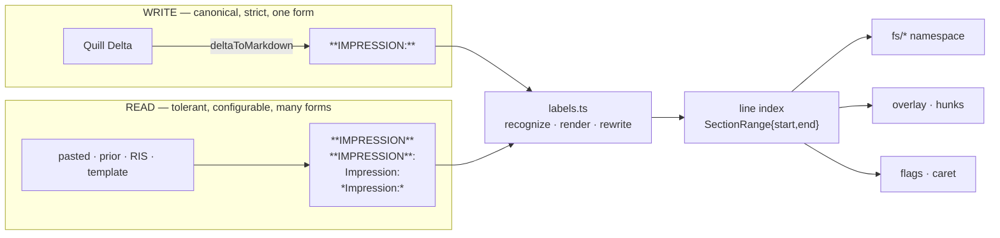
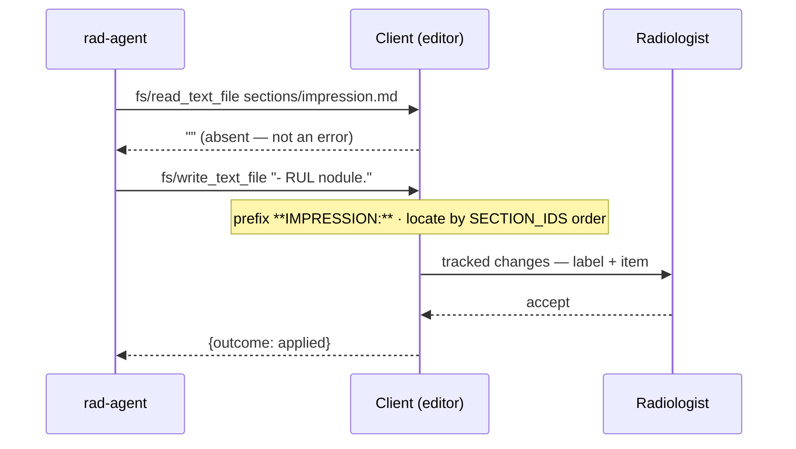

# ACP-Rad Demo — Report Parsing

> Source: the `/impression`-on-a-pasted-report defect (2026-08-31) + a port of KS's Python `radreportparser` · Date: 2026-08-31 · Mode: Design · Scope: text → sections, on the Client side only
> See also: [System & OOP Architecture](./01-system-architecture.md) §4 (the namespace the partition feeds) · [Surface (UX/AX)](./02-surface-architecture.md) §4 (what the agent sees) · [Data Architecture](./05-data-architecture.md) §3.3 (canonicalization; this doc replaces its one-line parse rule) · [ACP wire shape](../protocol/01-acp-shape.md) §5.4, §6 · Glossary [`CONTEXT.md`](../../CONTEXT.md) · Tracker [`progress/report-parsing.md`](../progress/report-parsing.md)

## 1. Overview

The report is one flat Markdown document. Everything the agent can address — `sections/findings.md`,
a flag's line number, a proposal's anchor — comes from one computation: **which line opens which
section**. That partition is recomputed on every read (design 05 §3.3); nothing about it is stored.

Until 2026-08-31 the recognizer was a single strict regex that only accepted the label form the
editor itself writes. A radiologist pasting a report from elsewhere — the ordinary way a report
enters the editor — produced *zero* sections, and every `sections/*.md` read failed `-32004` while
the listing still advertised them. The agent's own words: *"Unable to access the individual section
files despite their directory listing."*

The fix separates two jobs that had been one regex.

## 2. Two grammars



- **The writer stays strict.** `deltaToMarkdown` emits exactly one label form, `**LABEL:**`, and the
  agent's system prompt tells it to write the same. One canonical form in, one out — the fixed-point
  contract of design 05 §3.3 is untouched.
- **The reader becomes tolerant.** Anything a human recognizes as a section label is recognized as
  one. Tolerance is *read-only*: recognizing `**IMPRESSION**` never rewrites it. Text the radiologist
  typed or pasted is theirs until they approve a change to it (INV-1).

Bringing a document from the reader's grammar to the writer's is an explicit act — the `/normalize`
command, which proposes the rewrite as tracked changes like any other change.

## 3. The label rule

A label is **line-anchored** and **terminated**:

```text
^[^\w\n]*(KEYWORD)\b[^\w\n]*(?::|$)
   │         │       │  │        └── terminator: a colon, or nothing but decoration to end of line
   │         │       │  └─────────── trailing decoration: ** or * or :
   │         │       └────────────── no word character may follow the keyword
   │         └────────────────────── the keyword, case-insensitive
   └──────────────────────────────── leading decoration: ** · * · - · spaces
```

Two rules carry the whole design:

- **Anchored** — a label only ever opens a line. This is what keeps the partition line-indexed (§5),
  and it is what stops prose from being mistaken for structure.
- **Terminated** — after the keyword the line must hold a colon or end. Without this, tolerance
  becomes gullibility: `Findings are consistent with pneumonia.` would open a section.

| Accepted | Why |
|---|---|
| `**HISTORY:**` | the house form |
| `**HISTORY**: Known case of…` | colon outside the bold — what Word and the RIS paste |
| `HISTORY: 25F with headache` | plain text, no markup |
| `*Comparison:*` | italic label |
| `**IMPRESSION**` · `IMPRESSION` | bare label, no colon — terminated by end of line |
| `- IMPRESSION:` | a label that survived a bullet |
| `CLINICAL HISTORY:` · `Indications:` | vocabulary alternatives (§4) |

| Rejected | Why it must be |
|---|---|
| `Findings are consistent with pneumonia.` | prose, not a label — no terminator |
| `Comparison with the prior study is limited.` | ditto; the classic false positive (§5) |
| `**Lymph nodes**:` · `**Thoracic inlet**: …` | organ lines — a label line, but not a *section* label |
| `**Estimated radiation dose:**` | the technique header block stays inside `technique` |
| `HISTORYX: foo` | `\b` — the keyword must end where the word ends |
| `MDCT OF THE NECK` | the title, which precedes the first label and is read-only |

Verified against every fixture in `apps/editor/fixtures/` (reports, priors, templates, snippets):
the tolerant recognizer yields the **identical** label set as the old strict regex on all of them.
Tolerance is additive here — it changes nothing the editor already parsed.

## 4. The section profile

The vocabulary is data, not code (`packages/acp-rad/src/labels.ts`):

```ts
type LabelRule     = { id: SectionId; patterns: readonly string[] };
type SectionProfile = { labels: readonly LabelRule[]; footer: readonly string[] };
```

`HOUSE_PROFILE` is the default, ported from `radreportparser`'s `KeyWord`:

| Section | Keywords |
|---|---|
| `history` | history · indication(s) · clinical history · clinical indication(s) |
| `technique` | technique(s) |
| `comparison` | comparison(s) |
| `findings` | finding(s) |
| `impression` | impression(s) |
| *(footer)* | Report Severity · Finalized Datetime · Preliminary Datetime |

Rules are tried in order, longest keyword first; the first match wins. **Footer** lines are not a
section: they close the section in progress and open nothing, so a report pasted whole out of the RIS
keeps its trailer in the document but outside every section file — the agent can read it in
`report.md` and can never edit it as part of `impression`.

`labels.ts` owns both directions, which is what makes `/normalize` a three-line command:

| Export | Direction |
|---|---|
| `sectionIdOfLine(line, profile?)` | recognize — the one seam; `sections.ts`, `overlay.ts`, `Workspace.tsx` all go through it |
| `isFooterLine(line, profile?)` | recognize — terminates the last section |
| `canonicalLabel(id)` | render — `"**IMPRESSION:**"`, the writer's one form |
| `normalizeLabels(md, profile?)` | rewrite — every recognized label to canonical form |

## 5. Why line ranges, not character offsets

`radreportparser` extracts sections as **strings** located by free-running regex over the whole
document. This editor needs **line ranges** — `SectionRange { id, start, end }` — because every
consumer downstream is line-indexed: `sectionRange` bounds a proposal's hunks (`overlay.ts`), a flag
addresses `locations[].line`, `sliceLines` serves ACP's `line`/`limit` window, and hunks anchor by
line equality so the radiologist can keep typing (INV-2, ADR 0002).

That is a shape mismatch, and it is also a safety one. Run unmodified on prose:

```text
FINDINGS:
Lung: Nodule at RUL. Comparison with the prior study is limited by technique.
Pleura: No effusion.
Bones: Normal.
```
```json
{ "technique":  "Pleura: No effusion.\nBones: Normal.",
  "comparison": "with the prior study is limited by" }
```

Two sections fabricated out of one sentence. For batch extraction over PACS exports that is noise;
here the agent would read `sections/technique.md`, receive findings prose, and propose an edit
anchored to a section that does not exist — and the human gate would be asked to approve it. Line
anchoring removes the whole class: a keyword inside a sentence is a word, not a heading.

So what crosses from Python is the **keyword model and its configurability**, not the engine. The two
engines should differ, because their jobs differ.

## 6. Absent sections and the static manifest

The defect had a second half. `session/new._meta.rad.manifest` was built from the sections that
happened to exist at connect and never refreshed, so after any change to the document the listing and
the reads disagreed. Rather than add a refresh protocol, the section set is made constant:

| | Before | After |
|---|---|---|
| `manifest()` | the sections present at `session/new` | always the five `SECTION_IDS` |
| `read(sections/{id}.md)`, section absent | throws `-32004` | returns `""` |
| write to an absent section | `-32004` before any proposal is built | the editor materializes it |

The manifest is now derived entirely from fixture-constant inputs (report, meta, five sections,
priors, templates, snippets) and **cannot go stale**. `""` is unambiguous: a section that is present
always contains at least its own label line, so an empty read means absent.

**Materializing a section** keeps the invariant where it belongs. The agent writes only its content;
the Client — which owns the canonical grammar — prefixes `canonicalLabel(id)` and places the result
at the canonical position by `SECTION_IDS` order (after the last earlier section present, else after
the title). The label appears in the tracked-change diff, so the radiologist approves the section's
creation along with its content. Nothing is written that was not shown.



## 7. Boundary with `radreportparser` (Python)

`~/my_pkg/radreportparser` stays the tool for batch extraction over exported reports; this package
stays the tool for a live editor. They share a problem, not an implementation.

The artifact worth sharing is the **profile plus a conformance corpus** — one keyword vocabulary and
one set of golden input→sections cases that both engines must pass — not the code. That keeps
"the parser missed a label" a one-file fix, while each side keeps the engine its job requires
(line-based here, offset-based there). Deferred; see the tracker's P4.

Two defects found in the Python package while porting, worth fixing there: the mid-prose false
positives shown in §5, and `verbose=True` printing to **stdout** (`_position.py`) — harmless in a
notebook, fatal inside an ACP agent, where stdout is the wire.

## 8. Extension points

| Seam | How |
|---|---|
| A new section vocabulary (another institution, another language) | a `SectionProfile` passed to `createReportStore`; `HOUSE_PROFILE` is only the default |
| A new label form | add a keyword to a `LabelRule`; the anchoring and terminator rules are structural and should not move |
| A new report source (RIS trailer, foreign template) | usually a `footer` entry, not a code change |
| A different canonical form | `canonicalLabel` — the single place the writer's grammar is spelled |

## 9. Open questions

- 💡 **Organ lines are not modelled.** `**Lymph nodes:**` is a label line (glossary) but not a section
  label, and nothing addresses one. If a skill ever needs to edit one organ paragraph, the partition
  needs a second level — decide then whether that is a sub-range or a separate concern.
- 💡 **A label with a tail** (`IMPRESSION AND RECOMMENDATION:`) is not recognized; the terminator rule
  requires the colon to follow the keyword. Deliberate — allowing a tail re-opens the prose false
  positives. Add the whole phrase as a keyword if a real report needs it.
- Thai-language labels are out of scope: reports at Ramathibodi are written in English.
- `sectionFile()` keeps returning `string | undefined` — absence is still expressible at the parse
  layer. Only the store's wire semantics changed (§6).
