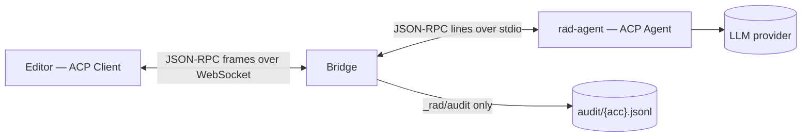
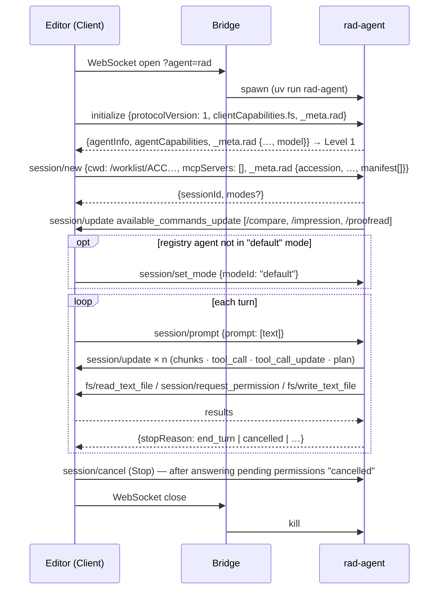

# ACP as spoken by the ACP-Rad Demo

> Source: this repo at `main @ 96ffec2` · `@agentclientprotocol/sdk` 1.4.0 (TypeScript, in the browser) · `agent-client-protocol` 0.12.1 + `deepagents-acp` 0.0.11 (Python) · Date: 2026-08-30 · Mode: Explain
> See also: [Data Architecture](../design/05-data-architecture.md) — what the frames carry and where it rests · [System Architecture](../design/01-system-architecture.md) §6, §8 · [Agentic Architecture](../design/03-agentic-architecture.md) §3, §6 · Profile proposal [`ideas/acp-rad-protocol-proposal.md`](../ideas/acp-rad-protocol-proposal.md) · Glossary [`CONTEXT.md`](../../CONTEXT.md)

## 1. ACP in one paragraph

The Agent Client Protocol is JSON-RPC 2.0 between two peers that both expose methods: the **Client** (an editor — owns the UI, the files, the permission gate) and the **Agent** (the AI process). Either side sends requests (with `id`, expecting a result or error) and notifications (no `id`). The baseline transport is newline-delimited JSON over the agent's stdio. `protocolVersion: 1`. Three sanctioned extension slots: a `_meta` object on any message, `_`-prefixed custom methods, and custom capabilities at `initialize`. ACP-Rad uses exactly those three and nothing else — the profile never adds a root field.

In this demo **the browser is the Client**: the TypeScript SDK has no Node dependency and speaks ACP over a WebSocket stream, so there is no server-side client and no protocol duplication. The Python agent is a `deepagents-acp` `AgentServerACP` subclass that inherits the whole vanilla surface and adds the profile.

## 2. Peers and transport

```text
 Radiologist ──► apps/editor (browser)               apps/bridge (Node 26)              agents/rad-agent (Python 3.13)
                 ACP CLIENT                           dumb pipe                          ACP AGENT
                 @agentclientprotocol/sdk 1.4.0       ws 8 · one frame ⇄ one NDJSON line  agent-client-protocol 0.12.1
                 ws://localhost:8787/acp?agent=rad    spawn agents.json[id] per socket    stdio: stdout = wire · stderr = logs
```

Bridge rules (`apps/bridge/src/index.ts`): one WebSocket connection = one agent subprocess; browser frames become stdin lines and stdout lines become frames, verbatim; the bridge parses **nothing** except a browser-side frame containing `_rad/audit`, which it persists to `audit/{accession}.jsonl` and drops; socket close kills the agent, agent exit closes the socket (`1011`); unknown `?agent=` closes with `4004`. `BRIDGE_TRACE=1` logs one line per frame, method and id only. Registry (`agents.json`): `rad` (ours, `uv run … rad-agent`) · `claude` (`@agentclientprotocol/claude-agent-acp`) · `gemini` (`gemini --experimental-acp`) — the last two are Level 0 spike targets.



## 3. Method surface

Every method the v1 SDKs know, and what this demo does with it. "Request" expects a response; "notification" does not.

### 3.1 Client → Agent

| Method | Kind | ACP purpose | Here |
|---|---|---|---|
| `initialize` | request | version + capability handshake | **used** — `clientCapabilities.fs = {readTextFile, writeTextFile}` (no `terminal`), `clientInfo`, `_meta.rad` client caps; result carries `agentInfo` and `_meta.rad` agent caps → Level |
| `authenticate` | request | auth methods offered at initialize | not used; the agent leaves it unimplemented (router answers *method not found*) |
| `session/new` | request | open a session in a `cwd` with MCP servers | **used** — `cwd = /worklist/{acc}`, `mcpServers: []`, `_meta.rad` session binding + manifest |
| `session/load` · `session/resume` · `session/fork` · `session/list` · `session/close` · `session/delete` | request | session persistence & management | not used — out of v0.1; `deepagents-acp` advertises `loadSession: false` |
| `session/prompt` | request | one user turn; returns when the turn ends | **used** — `prompt: [{type: "text", text}]`; a `/skill [arg]` text is expanded agent-side; result `{stopReason}` |
| `session/cancel` | notification | abort the running turn | **used** — *Stop*; the client first answers every in-flight permission `cancelled` |
| `session/set_mode` | request | switch the agent's permission mode | used only as **Level 0 hygiene** — pin `default` when a registry agent starts in another mode |
| `session/set_config_option` | request | runtime config switching | **used (slice 6)** — the agent advertises a `model` select in `session/new.configOptions` (`RAD_MODELS`); the editor's sidebar select sends `{sessionId, configId: "model", value}` and the agent rebuilds its graph. No profile extension involved — the provider switch is plain ACP. |
| `session/set_model` | request | runtime model switching | not used — `set_config_option` covers it |

### 3.2 Agent → Client

| Method | Kind | ACP purpose | Here |
|---|---|---|---|
| `session/update` | notification | the stream: text, thoughts, tool calls, plan, commands, mode | **used** — reduced into the sidebar; `tool_call` diffs become proposals (§5.5) |
| `session/request_permission` | request | ask before a tool runs | **used** — the agent offers the three clinical verbs; the client answers from per-hunk decisions (§5.7) |
| `fs/read_text_file` | request | read a file the client owns | **used** — served from the `ReportStore` (virtual namespace, `line`/`limit` windows) |
| `fs/write_text_file` | request | write a file the client owns | **used** — never applied: judged against the grant, answered with `_meta.rad.outcome` (§5.9) |
| `terminal/create` · `terminal/output` · `terminal/wait_for_exit` · `terminal/kill` · `terminal/release` | request | run shell commands in the client | **pruned** — the client does not advertise `terminal`; no handler is registered |

### 3.3 Extensions (`_`-prefixed)

| Method | Direction | Kind | Here |
|---|---|---|---|
| `_rad/audit` | Client → (bridge) | notification | **used** — the bridge persists and drops it; it never reaches the agent (§5.11) |
| `_rad/flag` | Agent → Client | request | **used** (slice 5) — the QA channel; the Client answers `{outcome: "acknowledged"}` on receipt (§5.12) |
| `_rad/focus_state` · `_rad/section_patch` | — | — | proposal-only; dropped or replaced in this demo (design 01 §8) |

Capabilities as advertised: client `{fs: {readTextFile: true, writeTextFile: true}}`; agent (unchanged from `deepagents-acp`) `{loadSession: false, promptCapabilities: {image: true}}`. The profile's own capabilities live entirely in `_meta.rad` (§7).

## 4. Session lifecycle



A turn is the unit of the conversation: `session/prompt` returns only when the agent is done, and every agent-initiated request in between (`fs/*`, `request_permission`) is answered by the client while the prompt is still outstanding. `available_commands_update` is sent as a task after the `session/new` response so a strict client sees the response first.

## 5. Message shapes as sent here

Shapes below are what the code sends, trimmed to the fields that matter. `sessionId` is a 32-hex string minted by the agent.

### 5.1 `initialize`

```jsonc
// → agent (connection.ts)
{ "protocolVersion": 1,
  "clientCapabilities": { "fs": { "readTextFile": true, "writeTextFile": true } },
  "clientInfo": { "name": "acp-rad-editor", "version": "0.1.0" },
  "_meta": { "rad": { "profileVersion": "0.1", "focusState": true, "flags": true,
                      "clinicalPermissionVerbs": true, "codedContent": [] } } }
// ← agent (server.py)
{ "protocolVersion": 1,
  "agentInfo": { "name": "rad-report-agent", "version": "0.1.0" },
  "agentCapabilities": { "loadSession": false, "promptCapabilities": { "image": true } },
  "_meta": { "rad": { "profileVersion": "0.1", "focusState": false, "flags": false,
                      "codedContent": [], "model": "openai:gpt-5.6-terra" } } }
```

`levelOf(result._meta)`: absent or malformed `rad` → **0**; present → **1**; `flags` or non-empty `codedContent` → **2**. `model` is informational (header + audit). A Level 0 agent simply ignores the client's `_meta`.

### 5.2 `session/new`

```jsonc
// → agent
{ "cwd": "/worklist/ACC0000012", "mcpServers": [],
  "_meta": { "rad": { "accession": "ACC0000012", "modality": "CT", "region": "chest",
                      "protocol": "contrast", "setting": "ER", "reportStatus": "draft",
                      "shortPrelim": false, "phiBoundary": "research_synthetic",
                      "manifest": [ "/priors/ACC0000010/report.md", "/priors/ACC0000011/report.md",
                                    "/priors/index.md", "/snippets/discuss-with-dr.md", "…",
                                    "/worklist/ACC0000012/meta.json", "/worklist/ACC0000012/report.md",
                                    "/worklist/ACC0000012/sections/comparison.md", "…" ] } } }
// ← agent
{ "sessionId": "16a6e65056bc4230934a9262828ad432" }
```

One session ↔ one accession; `cwd` is the namespace root so a Level 0 agent scopes itself naturally. The manifest is the sorted list of every readable path — ACP v1 has no directory listing, so the agent's `ls`/`glob` answer from it. Registry agents may return `modes {currentModeId, availableModes[]}`; the editor pins `default`.

### 5.3 `session/update · available_commands_update` (skills)

```jsonc
{ "sessionId": "…", "update": { "sessionUpdate": "available_commands_update",
  "availableCommands": [
    { "name": "compare",    "description": "…", "input": { "hint": "prior accession or date" } },
    { "name": "impression", "description": "…" },
    { "name": "proofread",  "description": "…", "input": { "hint": "section" } } ] } }
```

One `prompts/skills/<name>.md` per entry (`skills.py`). The sidebar keeps them as `commands[]`; the composer's `/` lists skills only.

### 5.4 `session/prompt`

```jsonc
// → agent
{ "sessionId": "…", "prompt": [ { "type": "text", "text": "/compare" } ] }
// ← agent, when the turn ends
{ "stopReason": "end_turn" }
```

Agent-side, a text block matching `^/(name)( arg)?$` is replaced by the skill's body before the model sees it (`RadReportAgentServer.prompt`). `_meta.rad.focus` is schema-declared (`zRadPromptMeta`) but not sent yet. Stop reasons the SDK defines: `end_turn` · `cancelled` · `max_tokens` · `max_turn_requests` · `refusal`; the editor shows a *stopped* marker on `cancelled` and uses a local pseudo-value `error` when the request itself throws.

### 5.5 `session/update` kinds

| `sessionUpdate` | Payload used | Reduced into |
|---|---|---|
| `agent_message_chunk` | `content {type: text, text}` | appended to the trailing assistant message's last text part |
| `agent_thought_chunk` | same | a `reasoning` part |
| `tool_call` | `toolCallId, title, kind, status, content[], rawInput` | a `tool` part; a `diff` content block **immediately becomes a proposal** (before any permission request) |
| `tool_call_update` | same, all optional | patches the tool part; a `kind: edit` update carrying `rawInput {file_path, content}` (a `write_file`) becomes a whole-file proposal |
| `plan` | `entries[{content, status}]` | `plan[]` |
| `available_commands_update` | `availableCommands[]` | `commands[]` (§5.3) |
| `user_message_chunk` · `current_mode_update` · `session_info_update` | — | tolerated: kind name appended to `unknown[]` |

Tool kinds seen from `deepagents-acp`: `read` (`read_file`), `edit` (`edit_file`, `write_file`), `other`. Statuses: `pending` · `in_progress` · `completed` · `failed` — with one quirk: **`edit_file` never receives a completion update**; the resolved permission is the end of its story in the sidebar.

### 5.6 The `diff` content block

```jsonc
{ "type": "diff", "path": "/worklist/ACC0000001/sections/impression.md",
  "oldText": "- ...\n", "newText": "- Acute infarct, left MCA territory.\n" }
```

`oldText`/`newText` are the tool's `old_string`/`new_string` snippets, not whole files. The editor turns them into line-level hunks (`buildHunks`) and renders them as tracked changes in the report. Other content block types the SDK defines (`text`, `image`, `audio`, `resource`, `resource_link`, `terminal`, `content`) are not used for proposals.

### 5.7 `session/request_permission`

```jsonc
// ← agent (PermissionRewritingClient replaces deepagents' approve/reject/approve_always wholesale)
{ "sessionId": "…",
  "toolCall": { "toolCallId": "<fresh id>", "title": "edit_file", "kind": "edit",
                "rawInput": { "file_path": "/worklist/…/sections/impression.md",
                              "old_string": "- ...", "new_string": "- Acute infarct …" } },
  "options": [ { "optionId": "accept",      "name": "Accept",            "kind": "allow_once"  },
               { "optionId": "accept_edit", "name": "Accept for review", "kind": "allow_once"  },
               { "optionId": "reject",      "name": "Reject",            "kind": "reject_once" } ] }
// → agent, once every hunk is decided
{ "outcome": { "outcome": "selected", "optionId": "accept_edit" } }   // or { "outcome": "cancelled" }
```

Client side: options of kind `allow_always` / `reject_always` are filtered out (INV-1, so a Level 0 agent's "always allow" never appears); the request is matched to its proposal by `toolCallId` or, when `deepagents-acp` minted a fresh id for the interrupt, by `rawInput` (`matchPending`: path + old/new snippets); the answer is derived from the per-hunk decisions (`answerFor`: any accepted ⇒ `accept_edit` if any hunk was accepted for review and the option exists, else `accept`; none ⇒ `reject`). Agent side, `PermissionRewritingClient` maps `accept`/`accept_edit` → `approve` and `reject` → `reject` for `deepagents`' HITL resume. A request no proposal preceded is answered `cancelled` (audit `permission.unmatched`).

### 5.8 `fs/read_text_file`

```jsonc
// ← agent            → agent
{ "sessionId": "…", "path": "/worklist/ACC0000001/sections/findings.md", "line": null, "limit": null }
{ "content": "**FINDINGS:**\n**Cerebral parenchyma:** …\n" }
```

`line` is 1-based, `limit` counts lines (`sliceLines`). While a grant is open for `path` the client serves the proposal's **base text** rather than the live buffer (design 01 §6.1). Errors: `-32004` outside the namespace or absent section.

### 5.9 `fs/write_text_file`

```jsonc
// ← agent
{ "sessionId": "…", "path": "/worklist/ACC0000001/sections/impression.md", "content": "**IMPRESSION:**\n- Acute infarct …\n" }
// → agent — the profile's write outcome; the content itself is never applied
{ "_meta": { "rad": { "outcome": "applied", "toolCallId": "…", "accepted": ["p1-h1"], "discarded": [] } } }
```

Decision table (`connection.ts`): `final` report ⇒ `-32003`; read-only path ⇒ `-32003`; grant found and `canonicalize(content) === grant.expected` ⇒ `applied`; grant found but different ⇒ `partial` (the buffer keeps the radiologist's per-hunk result); **no grant** ⇒ unsolicited write — hunks synthesized from the current file vs `content`, rendered, the request held until decided, `-32010` if every hunk is rejected, else `applied`/`partial`. `deepagents`' `EditResult` cannot carry `_meta`, so the model learns of a `partial` only by re-reading — the system prompt tells it to.

### 5.10 `session/cancel`

```jsonc
{ "sessionId": "…" }
```

Sent by *Stop*. ACP requires every in-flight `session/request_permission` to be answered `cancelled` first — `ProposalStore.cancelAll()` does that and discards the rendered hunks; local (editor-command) proposals are untouched. The agent ends the turn with `stopReason: cancelled`.

### 5.11 `_rad/audit` (Client → bridge, notification)

```jsonc
{ "method": "_rad/audit", "params": {
    "ts": "2026-08-30T02:53:38.426Z", "sessionId": "16a6e6…", "accession": "ACC0000012",
    "actor": { "userId": "demo-radiologist", "role": "radiologist" },
    "agent": { "name": "rad-report-agent", "version": "0.1.0", "level": 1 },
    "event": "session.new", "outcome": "manifest=21" } }
```

Sent with `conn.agent.notify(AUDIT_METHOD, record)` on the same connection; the bridge appends `params` as one JSONL line and never forwards the frame. Event catalogue: data architecture §4.3.

### 5.12 `_rad/flag` (Agent → Client, request)

```jsonc
// ← agent
{ "method": "_rad/flag", "params": { "sessionId": "…", "kind": "discrepancy",
    "summary": "FINDINGS describe a right renal stone; IMPRESSION says left.",
    "locations": [ { "path": "/worklist/ACC…/sections/impression.md", "line": 2 } ] } }
// → agent
{ "outcome": "acknowledged" }
```

`kind ∈ {discrepancy, omission, unsupported, critical_uncommunicated}` — the schema, not the prompt, keeps style nits out (design 04 §3.5). `line` is the 1-based line of the file at `path` **as the agent read it**; the Client re-anchors it to its own buffer. A request rather than a notification so the Client's receipt is itself auditable; **`acknowledged` means the Client holds the flag and has marked the line** (KS, 2026-08-30) — the radiologist's acknowledgement is a local act (audit `flag.acknowledged`), and the proposal's `dismissed` is dropped. Wiring: `zFlagParams` in `packages/acp-rad`; agent side `flags.py` sends through the Python SDK's `AgentSideConnection.ext_method("rad/flag", params)` (which prepends the `_` and returns the raw result dict); client side the TS SDK's generic overload `onRequest("_rad/flag", zFlagParams, handler)` — no SDK change on either side.

## 6. Errors and stop reasons

| Code | Meaning | Raised by |
|---|---|---|
| `-32601` | method not found | the agent's unimplemented optional methods (`authenticate`, `session/load`, …); an unknown `_rad/*` (`ext_method`) |
| `-32003` | forbidden — read-only path, `final` report | `ReportStore.assertWritable`, `connection.ts` |
| `-32004` | not found — path outside the namespace, absent section, unknown prior/template/snippet | `ReportStore.read` / `assertWritable` |
| `-32010` | proposal rejected by the radiologist | unsolicited-write path when every hunk is rejected |
| `-32011` | canonicalization conflict | **declared, never raised** — an unfindable anchor becomes a hunk `conflict` and the write lands `partial` |

`RadError` inside the store is translated to `acp.RequestError(code, message)` at the wire (`guarded`). On the agent, `AcpClientBackend` never lets an error cross the tool boundary: it becomes `*Result(error=…)` text the model reads.

## 7. The profile's footprint on ACP — ledger

| Slot | Where | Content |
|---|---|---|
| `_meta.rad` | `initialize.params` | client caps (`RadClientCaps`) |
| `_meta.rad` | `initialize.result` | agent caps + `model` (`RadAgentCaps`) → Level |
| `_meta.rad` | `session/new.params` | session binding + `manifest` (`RadSessionMeta`) |
| `_meta.rad` | `session/prompt.params` | `focus` — declared, not sent |
| `_meta.rad` | `fs/write_text_file.result` | write outcome (`RadWriteOutcome`) — new in the PoC, not in the proposal draft |
| `_rad/audit` | notification, client → bridge | `AuditRecord` |
| `_rad/flag` | request, agent → client | `FlagParams` → `{outcome: "acknowledged"}` (Level 2; advertised `/qa` only when the client negotiated `flags`) |
| conventions | `cwd`, `Diff.path`, `fs/*` paths | always virtual (`/worklist/…`, `/priors/…`, `/templates/…`, `/snippets/…`); no real filesystem |
| permission options | `session/request_permission.options` | the three clinical verbs; never `*_always` for writes |
| pruned | `terminal/*`, `mcpServers` | not advertised / empty |

Everything above is enforced on the **client** side — the agent-side pieces (`PermissionRewritingClient`, `FilesystemPermission(deny)`) make a well-behaved agent ask first, but a Level 0 agent that never asks is still gated by the unsolicited-write path.

## 8. Quirks and confirmed contracts (SDK level)

- **Python router spreads `_meta`** — `acp`'s handler dispatch unpacks the request's `_meta` *contents* into kwargs, so `_meta.rad` arrives as `kwargs["rad"]` (`rad_meta()` in `server.py` accepts both).
- **`deepagents-acp` interrupt ids** — `session/request_permission` carries a fresh `toolCallId`, not the streamed tool call's; parallel `edit_file` calls are batched under **one** interrupt id (two requests, same id). The client correlates by `rawInput`; a proposal decided before its request arrives is answered when the request comes.
- **No completion for `edit_file`** — the tool card is considered done once its permission is resolved.
- **`deepagents-acp` hardcodes `approve` / `reject` / `approve_always`** — replaced wholesale by wrapping the connection (`PermissionRewritingClient`), never by copying `_handle_interrupts`.
- **`available_commands_update` after the `session/new` response** — sent from a task, not inline.
- **Cancel contract** — pending permissions are answered `cancelled` *before* `session/cancel` goes out.
- **Level 0 hygiene** — `session/set_mode: default` when a registry agent reports another mode; `allow_always` filtered client-side regardless.
- **StrictMode** — dev mounts twice, so two agents spawn per page load and the first connection is closed immediately.
- **`EditResult` cannot carry `_meta`** — the model cannot see `partial`; v0.2 candidate: a `_rad/` notification.
- **Custom methods on the TS SDK** — `onRequest(method: string, paramsParser, handler)` exists; `_rad/flag` is registered without touching the SDK.
- **Outgoing extension requests on the Python SDK** — `AgentSideConnection` has no `send_request`; use `ext_method(name, params)` (prepends `_`, returns the raw result dict, raises `RequestError` on an error response, `ConnectionError` on a dropped pipe). A tool that *raises* escapes the LangGraph loop and kills the `session/prompt` handler — `raise_flag` returns every failure as text; a pydantic validation error on its args becomes an error `ToolMessage` the model reads.

## 9. M×N → M+N — what this demo demonstrates

The reason this demo exists: without a protocol, every report editor that wants an AI agent integrates each agent separately (M editors × N agents). ACP promises that each side implements one contract (M + N). Does the demo demonstrate it? **Architecturally yes; empirically half; with one caveat about the profile.**

```text
                     vanilla ACP (M+N)                    ACP-Rad profile — a second contract
                     ─────────────────                    ──────────────────────────────────
 Editors (M=1)   ─┐                                   ┌─  _meta.rad · clinical verbs · manifest ·
   apps/editor    │  initialize · session/* ·         │   write outcome · _rad/flag
   smoke.ts (½)   ├──►  fs/* · request_permission  ◄──┤
                  │     one implementation per side   │   Level ladder = graceful degradation,
 Agents (N=3)    ─┘                                   └─  so Level 0 agents stay on the left
   rad · claude · gemini
```

### 9.1 Demonstrated — decoupling by construction

- **The editor has no agent-specific code path.** Its only agent-dependent inputs are `?agent=<id>` and the Level inferred from `initialize._meta.rad`. Three agents sit in `agents.json`; the two registry ones (`claude-agent-acp`, `gemini --experimental-acp`) were never written for a report editor, yet the same `connection.ts` handles them through the unsolicited-write path (§5.9).
- **The agent has no editor-specific code path.** `rad-agent` knows nothing about Quill or the browser: every byte it sees arrives through `fs/read_text_file`, every byte it proposes leaves through `fs/write_text_file`. `AcpClientBackend` is the entire coupling.
- **Swapping is safe because the invariants sit on the client.** INV-1, the read-only rules, the `final` lock and the audit are enforced in `apps/editor` (§7), so an unknown agent can be plugged in *without being trusted*. This is the strongest thing the demo shows: not the arithmetic, but why the arithmetic is acceptable in a clinical setting.

### 9.2 Not yet demonstrated — the numbers

| Side | Today | What would make it a result |
|---|---|---|
| N (agents) | N = 1 live (`rad`). Level 0 agents are wired but not exercised — they read the real disk, so they need the on-disk mirror + file-watch (slice 7). Spike 1b only touched `set_mode`. | a Level 0 registry agent completing scenario 1 against unchanged editor code |
| M (editors) | M = 1. `smoke.ts` is a genuine second client (headless, same wire, no agent change) but shares `acp-rad` and is ours — weak evidence. | a *foreign* ACP client (e.g. Zed) driving `rad-agent` unchanged: it would run as a plain file-editing agent over real paths (empty manifest ⇒ `ls`/`glob` empty; reads and edits still flow). Deferred — not before slice 5. |

### 9.3 The caveat — M+N holds only as far as the profile standardizes

Everything rad-native (`_meta.rad`, `accept · accept_edit · reject`, the manifest, the write outcome, `_rad/flag`) is a **second contract** on top of vanilla ACP (§7). Inside this demo both sides implement it once, so the sum still holds. If the profile stayed demo-local, every rad-aware editor × every rad-aware agent would re-negotiate it — M×N in miniature for exactly the features that matter clinically. Two things keep that from being fatal:

- the **Level ladder** — an agent that does not know the profile degrades to Level 0 instead of failing, so the vanilla M+N is never lost;
- **consolidating the profile into a standard** — the stated follow-on to this demo, and the reason its extensions are confined to `_meta.rad` and `_rad/*` (nothing that a conforming ACP peer would reject).

### 9.4 Two honest limits

1. **"Implement once" is idealized.** The editor already carries a quirks layer for `deepagents-acp` (§8): fresh interrupt ids matched by `rawInput`, batched permissions, no completion for `edit_file`, `set_mode: default` for registry agents. LSP clients grew the same thing. Expect a small per-agent shim table on the M side; the protocol shrinks it, it does not remove it.
2. **The bridge is a transport adapter, not a coupling** — it is agent-agnostic (spawn from a registry) — but it exists because ACP agents speak stdio and the remote transport is not yet stable. A browser client therefore always needs a launcher beside it.

**Verdict.** The claim is defensible as a design demonstration today; it becomes a measured result when a foreign client (M = 2) and a Level 0 agent (N = 2) both run against unchanged code.

## 10. Pointers

- Client wiring: `apps/editor/src/agent/connection.ts` · gate: `apps/editor/src/report/proposals.ts` · sidebar reducer: `apps/editor/src/sidebar/store.ts` · audit: `apps/editor/src/audit/log.ts`
- Bridge: `apps/bridge/src/index.ts`, `apps/bridge/agents.json` · headless client: `apps/bridge/scripts/smoke.ts`
- Agent: `agents/rad-agent/src/rad_agent/{server.py, permissions.py, backend.py, skills.py, agent.py}`
- Profile schemas: `packages/acp-rad/src/schema.ts` · namespace: `namespace.ts` · store: `store.ts`
- Upstream: ACP spec and SDKs — `@agentclientprotocol/sdk` (TS), `agent-client-protocol` (Python), `deepagents-acp` (LangGraph adapter)
- Runbook and tracing: `docs/dev/running.md` (`BRIDGE_TRACE=1`, audit trail)
