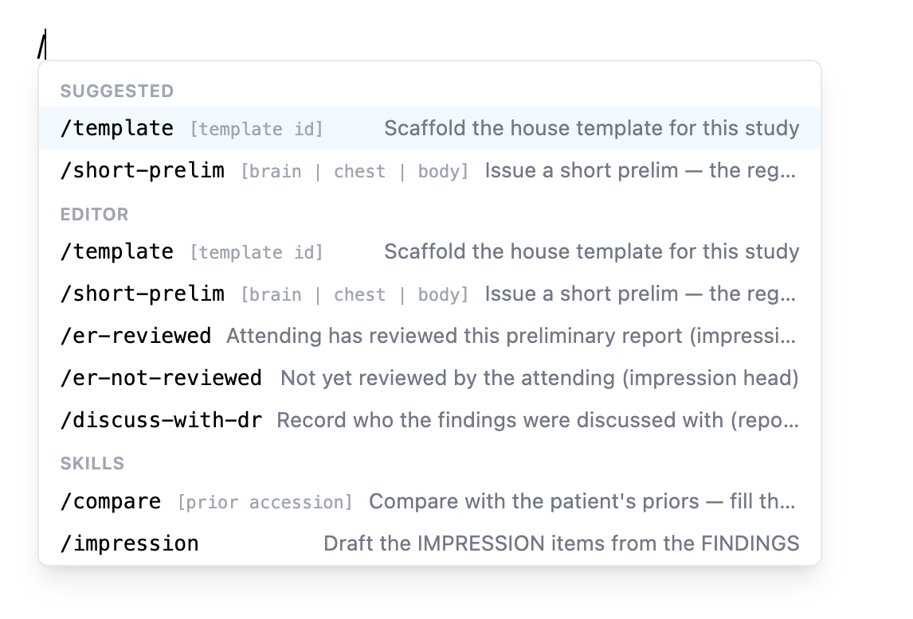
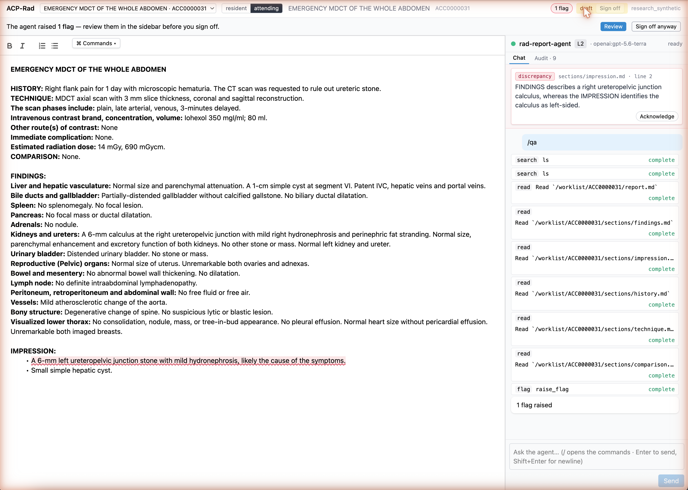
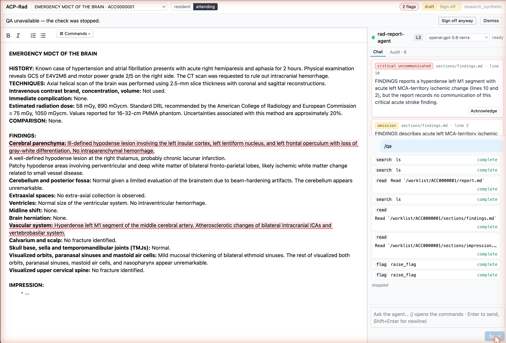
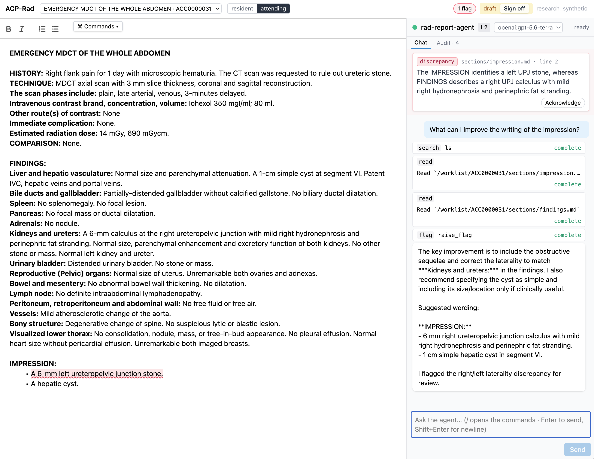
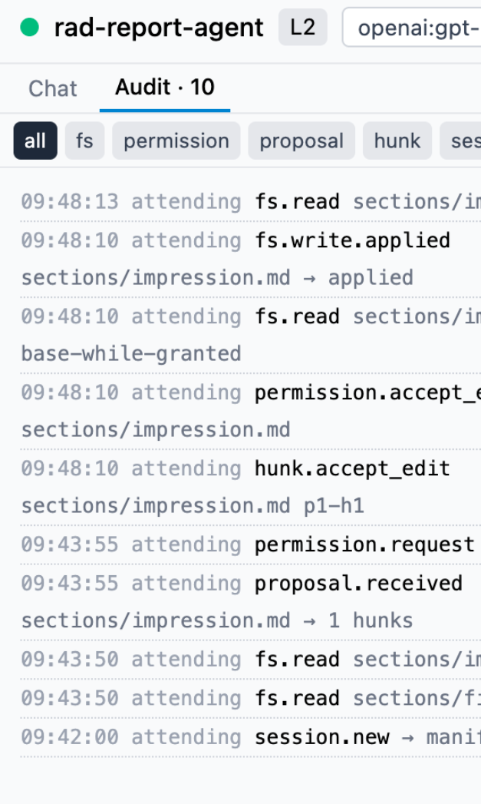

# Why {.act}

The sidebar problem, and a different way to plug an agent in.

## Every AI vendor builds its own sidebar

```{mermaid}
%%| fig-width: 9
%%| fig-height: 4.2
%%{init: {"flowchart": {"htmlLabels": false}}}%%
flowchart TB
    subgraph E[Report editors]
        e1[Editor A]
        e2[Editor B]
        e3[Editor C]
    end
    subgraph A[AI agents]
        a1[Agent 1]
        a2[Agent 2]
        a3[Agent 3]
    end
    e1 --- a1 & a2 & a3
    e2 --- a1 & a2 & a3
    e3 --- a1 & a2 & a3
```

::: {.takeaway}
M editors × N agents = M×N integrations. Each one decides *for itself* what the AI may write into your report.
:::

::: {.notes}
Today, when a vendor adds an AI assistant to a reporting system, it is a bespoke plugin: that vendor's agent, wired into that vendor's editor. Change the editor or change the agent and you start over. Worse, every integration has its own idea of what the AI is allowed to write, and how you find out.
:::

## The agent as a peripheral

```{mermaid}
%%| fig-width: 9
%%| fig-height: 4.2
%%{init: {"flowchart": {"htmlLabels": false}}}%%
flowchart TB
    subgraph E[Report editors]
        e1[Editor A]
        e2[Editor B]
        e3[Editor C]
    end
    P((one protocol<br/>ACP))
    subgraph A[AI agents]
        a1[Agent 1]
        a2[Agent 2]
        a3[Agent 3]
    end
    e1 & e2 & e3 --- P
    P --- a1 & a2 & a3
```

::: {.takeaway}
Like a modality on a DICOM network: the editor speaks the protocol once, and any agent that speaks it plugs in. M + N.
:::

::: {.notes}
The Agent Client Protocol — ACP — comes from the code-editor world, where the same problem was solved this year: one open contract between an editor and an AI agent. The analogy that matters for us is DICOM: a scanner does not need to know which PACS it will talk to. This demo asks whether a report editor can treat an AI agent the same way.
:::

## Ground rules

::: {.columns}
::: {.column width="55%"}
**The human gate**

Nothing enters the report except by your act — typing, accepting a change, running a command.

The agent reads and **proposes**. It never writes on its own.

**Every step is recorded** — what it read, what it proposed, what you decided.
:::
::: {.column width="45%"}
::: {.box .warn}
**This is a technology demo.**

Not for clinical use. Not a medical device.

All patients, reports and priors are synthetic.
:::
:::
:::

::: {.notes}
Two things to hold onto. First, the safety rule: the agent cannot put a byte into the report. It proposes; you decide, one change at a time. This rule is enforced by the editor, not by the agent, which means a badly behaved agent still cannot get past it. Second, the disclaimer: everything you'll see is synthetic and this is not a product.
:::

# The demo {.act}

Eight moments from a working prototype. Same editor, same agent, same protocol.

## The screen

{.shot .r-stretch fig-alt="The ACP-Rad editor: report on the left, agent sidebar on the right"}

::: {.takeaway}
Report on the left — the only text that exists. Agent on the right — Chat and Audit tabs, model selectable. Status and sign-off top right.
:::

::: {.notes}
Left: an ordinary report editor, house format, five sections. Right: the agent's sidebar. The header shows which agent, which conformance level, which model — the model is switchable in place. Top right: the report status and the sign-off control, and the flag count.
:::

## Start a study — no AI needed

::: {.columns}
::: {.column width="50%"}
{.shot fig-alt="The slash-command menu: Suggested, Editor, Skills"}
:::
::: {.column width="50%"}
`/` opens one menu, three groups:

- **Editor** — instant, deterministic: `/template` scaffolds the house template; `/short-prelim` issues a short preliminary; `/er-reviewed`, `/discuss-with-dr` drop the standard lines.
- **Skills** — the agent's: `/impression` · `/compare` · `/proofread` · `/qa`.
- **Suggested** — what fits this study right now.
:::
:::

::: {.takeaway}
The boring parts stay boring. Only the *Skills* group involves an AI.
:::

::: {.notes}
Before any AI: the editor keeps its deterministic commands. A blank ER CT brain gets its house template in one keystroke; the short-prelim, the attending-review markers, the discussed-with line — all instant, all local. The agent advertises its skills into the same menu, so the radiologist has one place to look.
:::

## `/impression` — the agent proposes

{.shot .r-stretch fig-alt="The agent's impression proposal shown as tracked changes with Accept, Accept for review, Reject"}

::: {.takeaway}
The agent read FINDINGS and proposed IMPRESSION items as tracked changes. Per change: **Accept** · **Accept for review** · **Reject**.
:::

::: {.notes}
The core moment. The agent reads the findings — you can watch each read in the sidebar — then proposes impression items. They appear as tracked changes in the report, not in the chat. Nothing has been written yet. Each change carries three verbs: Accept — it becomes your text; Accept for review — it lands but stays marked; Reject. Bulk verbs exist at the top.
:::

## You keep typing

::: {.columns}
::: {.column width="60%"}
**IMPRESSION:**

- [Acute infarction in the left MCA territory — likely M1 occlusion.]{.ins}
- [Chronic lacunar infarct at the right thalamus.]{.unrev}
- Mild mucosal thickening of bilateral ethmoid sinuses.
:::
::: {.column width="40%"}
[green]{.ins} — proposed, pending your decision

[amber]{.unrev} — accepted *for review*; clears the moment you edit the line, or all at once

plain — yours
:::
:::

::: {.takeaway}
A proposal is an overlay anchored to the lines it replaces. Your typing never blocks and is never overwritten; if you change those lines first, the proposal conflicts and the agent re-reads.
:::

::: {.notes}
Second rule: non-interference. While the agent works, you type. The proposal is an overlay, anchored to text, not to positions — if you have already rewritten that line, the proposal simply does not apply and the agent is told to look again. Accept-for-review is for the fast path: land it now, but the amber stays until you have touched it, so unreviewed AI text is always visible as such.
:::

## Priors and polish

| Skill | Reads | Proposes |
|---|---|---|
| `/compare` | the patient's prior reports (any modality, overlapping anatomy) | a true COMPARISON line and interval-change wording |
| `/proofread` | the section, house style | wording fixes; laterality / size / count consistency between FINDINGS and IMPRESSION |
| `/qa` | the whole report | **no edit** — flags only (next slide) |

::: {.takeaway}
Priors are read-only to the agent. Every skill ends in the same place: tracked changes you decide on.
:::

::: {.notes}
Two more skills. Compare reads the priors it is allowed to see — read-only — and fixes the comparison line, with dates checked. Proofread is the consistency pass: a right in findings and a left in impression is exactly what it looks for. Both produce proposals through the same gate. QA is different: it edits nothing.
:::

## `/qa` — the discrepancy

{.shot .r-stretch fig-alt="A discrepancy flag: right UPJ stone in FINDINGS, left in IMPRESSION"}

::: {.takeaway}
Right UPJ calculus in FINDINGS, *left* in IMPRESSION. The agent raises a **flag** and marks the line — it changes nothing.
:::

::: {.notes}
A planted error: the findings describe a right ureteropelvic-junction stone; the impression says left. QA raises a flag — discrepancy, with the line — and the editor underlines the line. No edit is proposed; this is a check, and the fix is yours. Flags are acknowledged in the sidebar.
:::

## The sign-off gate

{.shot .r-stretch fig-alt="Sign off runs QA: a critical uncommunicated stroke finding is flagged"}

::: {.takeaway}
**Prelim** / **Sign off** run `/qa` first. An acute stroke with no *discussed with* line is flagged *critical, uncommunicated*. *Sign off anyway* stays your call.
:::

::: {.notes}
The same check runs when you press Prelim or Sign off. Here an acute left MCA infarct is in the findings, the impression is empty, and no communication is recorded — two flags. The gate never blocks you: Sign off anyway is right there. It makes sure you saw it.
:::

## Ask anything

{.shot .r-stretch fig-alt="Free-text question to the agent about improving the impression"}

::: {.takeaway}
Free text works too. If the answer wants to edit the report, it goes through the same gate as a skill.
:::

::: {.notes}
It is still a chat: ask what could be improved, ask it to explain. If it decides to edit, the edit becomes a proposal like any other. There is no back door through the chat box.
:::

## Everything is on the record

::: {.columns}
::: {.column width="42%"}
{.shot .audit fig-alt="The Audit tab: one line per read, proposal, decision, and write"}
:::
::: {.column width="58%"}
One `/impression`, read bottom-up:

| Record | Meaning |
|---|---|
| `session.new → manifest=19` | the agent was told which 19 paths it may read |
| `fs.read sections/findings.md` | what it looked at |
| `proposal.received → 1 hunks` | what it wanted to change |
| `permission.request` | the editor asked you |
| `hunk.accept_edit` | your decision — *Accept for review* |
| `fs.write.applied` | what actually landed |

Same records in the sidebar and in `audit/{accession}.jsonl` on disk.
:::
:::

::: {.takeaway}
When a colleague asks "what did the AI do to this report?", this is the answer.
:::

::: {.notes}
The audit tab is the same stream that is written to disk: what the agent read, what it proposed, which verb you chose on which change, what actually landed. Notice that the write is recorded after your decision, and that the agent's read after the write is what it uses to learn what you kept.
:::

# Under the hood {.act}

Four slides for the engineers. Skip freely.

## Three boxes {.tech}

[engineering]{.slide-tag}

```{mermaid}
%%| fig-width: 12
%%| fig-height: 3.6
%%{init: {"flowchart": {"htmlLabels": false}}}%%
flowchart LR
    R([Radiologist]) -->|types · prompts · decides| E
    E["apps/editor
    browser · React + QuillJS
    the ACP client
    owns the gate, the rules, the audit"]
    B["apps/bridge
    Node · WebSocket ⇄ stdio
    a dumb pipe"]
    A["agents/rad-agent
    Python · deepagents
    the ACP agent · untrusted"]
    L[("LLM
    OpenAI · Anthropic · Ollama")]
    E <-->|ACP v1 / WebSocket| B
    B <-->|ACP v1 / stdio| A
    A --> L
```

::: {.takeaway}
The browser *is* the protocol client. The bridge only exists because agents speak stdio. Anything that enforces a rule lives in the editor.
:::

::: {.notes}
Three processes. The editor in the browser speaks ACP directly — the TypeScript SDK has no server dependency. The bridge is a launcher: it spawns one agent per connection from a registry and shuttles frames; it parses nothing except the audit. The agent is a Python deep-agent that only ever sees the report through the protocol's file-read call. The model behind it is switchable at runtime through a standard ACP config option.
:::

## One turn on the wire {.tech .seq}

[engineering]{.slide-tag}

```{mermaid}
%%| fig-width: 10
%%| fig-height: 5.2
%%{init: {"sequence": {"actorMargin": 140, "messageMargin": 26, "height": 40, "boxMargin": 6, "mirrorActors": false}}}%%
sequenceDiagram
    autonumber
    participant R as Radiologist
    participant E as Editor (client)
    participant A as Agent
    R->>E: /impression
    E->>A: session/prompt
    A->>E: fs/read_text_file  sections/findings.md
    E-->>A: content
    A->>E: tool_call  edit_file (diff)
    E->>R: tracked changes in the report
    A->>E: session/request_permission  [accept · accept_edit · reject]
    R->>E: decides each change
    E-->>A: outcome: accept_edit
    A->>E: fs/write_text_file  sections/impression.md
    E-->>A: _meta.rad.outcome = applied | partial
```

::: {.takeaway}
Standard ACP calls; radiology rides in `_meta`. The agent's write is *acknowledged*, never applied — the accepted text is already in the buffer.
:::

::: {.notes}
A single skill turn. Prompt in; the agent reads a section; it emits an edit as a diff, which the editor renders as tracked changes; it asks permission — and the permission options are the clinical verbs, not allow/deny. Once every change is decided, the answer goes back, the agent writes, and the editor replies with an outcome: applied, or partial if you kept only some. The write itself is a no-op; the gate already happened.
:::

## The ACP-Rad profile {.tech}

[engineering]{.slide-tag}

| Addition | Where it rides | Why |
|---|---|---|
| Namespace + manifest — sections, metadata, priors, templates, snippets as paths | `session/new` `_meta.rad` | the agent needs a map of what it may read |
| Clinical verbs `accept · accept_edit · reject` | `request_permission` options | decisions mean something in the audit; never "always allow" |
| Write outcome `applied` / `partial` | `fs/write_text_file` `_meta.rad` | the agent learns what actually landed |
| `_rad/flag` | custom method | QA without an edit |
| Level 0 / 1 / 2 | `initialize` `_meta.rad` | graceful degradation: a plain ACP agent still works |

::: {.takeaway}
Only sanctioned extension points — `_meta` and `_`-prefixed methods. A conforming ACP peer never sees a field it must reject.
:::

::: {.notes}
Everything radiology-specific is a profile on top of ACP, confined to the places ACP reserves for extensions. That is what makes the level ladder work: an off-the-shelf coding agent connects at level 0 and gets plain file edits through the same gate; our agent connects at level 2 and gets flags and clinical verbs. The intent is to consolidate this profile into a standard, separately from this demo.
:::

## M × N → M + N, honestly {.tech}

[engineering]{.slide-tag}

::: {.columns}
::: {.column width="50%"}
**Demonstrated — by construction**

- The editor has no agent-specific code path.
- The agent has no editor-specific code path.
- Swapping is safe because the invariants sit on the client.
:::
::: {.column width="50%"}
**Not yet — by measurement**

- N = 1 live agent; two off-the-shelf agents are wired, not exercised.
- M = 1 editor; a headless test client is weak evidence.
- Every real client grows a small quirks layer per agent — LSP did too.
:::
:::

::: {.takeaway}
It becomes a *result* when a foreign editor drives this agent, and a foreign agent completes a scenario in this editor, both unchanged.
:::

::: {.notes}
The claim we can defend today is architectural: the two sides are decoupled by construction and the safety does not depend on trusting the agent. The empirical half — plugging in an editor we did not write, and an agent we did not write — is the next experiment, not this one.
:::

# What next {.act}

What this is, what it isn't, and where the profile goes.

## What this is — and isn't

::: {.columns}
::: {.column width="50%"}
**Is**

- A working prototype: template → draft → compare → QA → sign-off gate
- One editor, one protocol, any agent
- The human gate, enforced by the editor, auditable
:::
::: {.column width="50%"}
**Isn't**

- A product, or a medical device
- Validated on real reports — all data synthetic
- Tied to one model — switchable at runtime
:::
:::

<br/>

**For you, the radiologist:** what would you want the agent to do — and what must it never do?

::: {.notes}
Close on the question that matters. The mechanism is settled enough to argue about behaviour: which skills would earn a place in the menu, and which lines the agent must never cross. That input shapes the profile before it becomes a standard.
:::

## Try it

```sh
git clone https://github.com/radrama-ai/acp-rad-demo.git
cd acp-rad-demo && just install && just dev
```

- Runs on a laptop; hosted or local (Ollama) models.
- Design, protocol shape and the M×N analysis are in `docs/`.
- The profile draft: `docs/ideas/acp-rad-protocol-proposal.md` → a standard, next.

<br/>

[MIT licensed · synthetic fixtures only · not for clinical use]{.muted .small}

::: {.notes}
Everything shown is in the repository, including the design documents and the protocol analysis. The follow-on is the profile itself, written up for other editors and agents to implement.
:::
